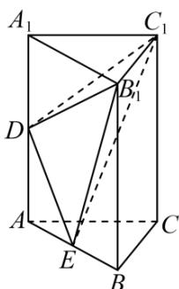

> [!faq]- 《专题14_简单几何体的表面积和体积_高效培优期中专项训练_数学人教A版》官方解析
>
> > [!success]- **【答案】** 
>
> > [!note]- **【解析】**
> > $\because S_{\triangle B_{1}DE}=S_{\text{矩形}ABB_{1}A_{1}}-S_{\triangle A_{1}B_{1}D}-S_{\triangle ADE}-S_{\triangle EBB_{1}}$ ，
> >
> > E 是 AB 的三等分点（靠近点 A），D 是 $AA_{1}$ 的中点，
> >
> > $\therefore S_{\triangle A_1B_1D} = \frac{1}{2} S_{\triangle AA_1B_1}, S_{\triangle ADE} = \frac{1}{6} S_{\triangle AA_1B_1}, S_{\triangle EBB_1} = \frac{2}{3} S_{\triangle ABB_1} = \frac{2}{3} S_{\triangle AA_1B_1}$
> >
> > 又 $\because S_{\text{矩形} ABB_1A_1} = 2S_{\triangle AA_1B_1}$
> >
> > $$
> > \therefore S _ {\triangle B _ {1} D E} = 2 S _ {\triangle A A _ {1} B _ {1}} - \frac {1}{2} S _ {\triangle A A _ {1} B _ {1}} - \frac {1}{6} S _ {\triangle A A _ {1} B _ {1}} - \frac {2}{3} S _ {\triangle A A _ {1} B _ {1}} = \frac {2}{3} S _ {\triangle A A _ {1} B _ {1}}
> > $$
> >
> > $$
> > \therefore V _ {C _ {1} - D E B _ {1}} = \frac {2}{3} V _ {C _ {1} - A A _ {1} B _ {1}} = \frac {2}{3} V _ {A - A _ {1} B _ {1} C _ {1}} = \frac {2}{3} \times \frac {1}{3} V _ {A B C - A _ {1} B _ {1} C _ {1}} = \frac {2}{9} V _ {A B C - A _ {1} B _ {1} C _ {1}}.
> > $$
> >
> > ∴三棱锥 $D-B_{1}C_{1}E$ 的体积与三棱柱 $ABC-A_{1}B_{1}C_{1}$ 的体积之比为 2:9.
> >
> > 故答案为：2:9.
