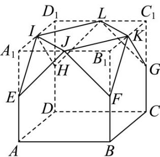

> [!faq]- 《专题14_简单几何体的表面积和体积_高效培优期中专项训练_数学人教A版》官方解析
>
> > [!success]- **【答案】** (1)证明见解析 (2) $\left(16,16\sqrt{2}\right)$
>
> > [!note]- **【解析】**
> > （1）由图1可知水体的体积为 $V=4\times4\times2=32$
> >
> > 图 $^{2}$ 中，水体所形成几何体体积不变，则
> >
> > $$
> > V = S _ {A B B _ {2} A _ {2}} \cdot B C = \frac {\left(A A _ {2} + B B _ {2}\right) \cdot A B}{2} \cdot B C = 8 \left(A A _ {2} + B B _ {2}\right) = 3 2.
> > $$
> >
> > 所以 $AA_{2} + BB_{2} = 4$ ，即 $AA_{2} + BB_{2}$ 是定值 4.
> >
> > (2) 设 $AA_{2}=x$ ，则 $BB_{2}=4-x$ ，
> >
> > $$
> > C _ {2} D _ {2} = \sqrt {1 6 + (4 - 2 x) ^ {2}} = \sqrt {4 x ^ {2} - 1 6 x + 3 2} = 2 \sqrt {x ^ {2} - 4 x + 8}, x \in (0, 2).
> > $$
> >
> > 所以 $S_{A_{2}B_{2}C_{2}D_{2}} = B_{2}C_{2} \cdot C_{2}D_{2} = 8\sqrt{x^{2} - 4x + 8}$ .
> >
> > 因为函数 $x^{2} - 4x + 8$ 是开口向上，对称轴为 $x = 2$ 的抛物线，而 $x\in (0,2)$
> >
> > 所以 $x^{2}-4x+8\in(4,8)$ ，所以 $8\sqrt{x^{2}-4x+8}\in(16,16\sqrt{2})$ .
> >
> > 所以水面 $A_{2}B_{2}C_{2}D_{2}$ 面积的取值范围为 $(16,16\sqrt{2})$ .
> >
> > 10．石凳是以天然石材或人造石为原料制作的凳椅，是一种常见的户外休闲设施．如图，这是某广场的石凳直观图，它是由正方体 $ABCD - A_{1}B_{1}C_{1}D_{1}$ 截去四面体 $A_{1}EIJ$ ， $B_{1}FJK$ ， $C_{1}GKL$ ， $D_{1}HLI$ 得到的，其中 $E,F,G,H,I,J,K,L$ 均为各棱的中点，且 $AB = 60$ 厘米．
> >
> > 
> >
> > (1)求该石凳的体积；
> >
> > (2)求该石凳的表面积（不包含底面ABCD）.
> >
> > 【答案】(1)该石凳的体积198000立方厘米
> >
> > (2)该石凳的表面积 $\left(1800\sqrt{3}+12600\right)$ 平方厘米
> >
> > 【详解】（1）由题意可得正方体 $ABCD - A_{1}B_{1}C_{1}D_{1}$ 的体积 $V_{1} = 60^{3} = 216000$ 立方厘米，
> >
> > 四面体 $A_{1}EIJ$ 的体积 $V_{2}=\frac{1}{3}\times\frac{1}{2}\times30^{2}\times30=4500$ 立方厘米，
> >
> > 则该石凳的体积 $V = V_{1} - 4V_{2} = 216000 - 4 \times 4500 = 198000$ 立方厘米
> >
> > (2) 由题意可得 $\triangle EIJ$ ， $\triangle FJK$ ， $\triangle GKL$ ， $\triangle HLI$ 均为边长为 $30\sqrt{2}$ 厘米的等边三角形，四边形 $IJKL$ 是边长为 $30\sqrt{2}$ 厘米的正方形，
> >
> > 则 $\triangle EIJ$ 的面积 $S_{1} = \frac{\sqrt{3}}{4}\times \left(30\sqrt{2}\right)^{2} = 450\sqrt{3}$ 平方厘米，
> >
> > 正方形 IJKL 的面积 $S_{2}=\left(30\sqrt{2}\right)^{2}=1800$ 平方厘米，
> >
> > 五边形 $ABFJE$ 的面积 $S_{3} = 60 \times 60 - 30 \times 30 = 2700$ 平方厘米，
> >
> > 故该石凳的表面积 $S = 4S_{1} + S_{2} + 4S_{3} = \left(1800\sqrt{3} + 12600\right)$ 平方厘米.
