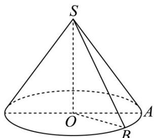

> [!faq]- 《专题14_简单几何体的表面积和体积_高效培优期中专项训练_数学人教A版》官方解析
>
> > [!success]- **【答案】** $4+\frac{\sqrt{2}+1}{2}\pi$
>
> > [!note]- **【解析】**
> > 将一个腰长为 $^{2}$ 的等腰直角三角形绕着它的一条直角边所在的直线旋转 $\frac{\pi}{4}$ 弧度，
> >
> > 所得几何体为一个圆锥切割 $\frac{1}{8}$ 的几何体，
> >
> > 由题意可知，圆锥的底面半径为 $^{2}$ ，高为 $^{2}$ ，则母线长为 $2\sqrt{2}$
> >
> > 圆锥表面积为 $S_{1}=\pi\times2\times2\sqrt{2}+2\pi\times2=4(\sqrt{2}+1)\pi$
> >
> > $S_{\triangle SOA} = S_{\triangle SOB} = \frac{1}{2}\times 2\times 2 = 2$
> >
> > 所以形成的几何体的表面积为 $S=\frac{1}{8}S_{1}+2S_{\triangle SOA}=\frac{1}{8}\times4(\sqrt{2}+1)\pi+2\times2=4+\frac{\sqrt{2}+1}{2}\pi$
> >
> > 故答案为： $4+\frac{\sqrt{2}+1}{2}\pi$
> >
> > 
