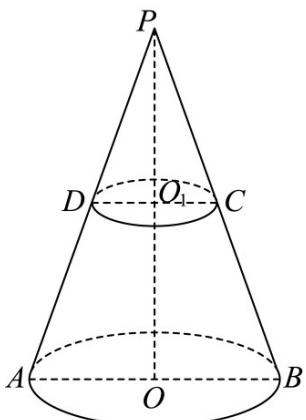
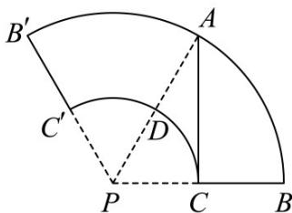
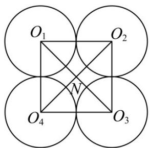

> [!faq]- 《专题14_简单几何体的表面积和体积_高效培优期中专项训练_数学人教A版》官方解析
>
> > [!success]- **【答案】** (1) $\frac{14\sqrt{2}}{3}\pi$ (2) $3\sqrt{3}$
>
> > [!note]- **【解析】**
> > （1）由 $AB = 4, CD = 2$ ，得圆台的下底面的半径为 $R = 2$ ，上底面的半径为 $r = 1$
> >
> > 设圆台的高为 $h$ ，则 $\frac{1}{2} \times (2 + 4) \cdot h = 6\sqrt{2}$ ，所以 $h = 2\sqrt{2}$
> >
> > 所以圆台的体积为 $V=\frac{1}{3}\left(r^{2}+R^{2}+Rr\right)\pi h=\frac{1}{3}\left(1^{2}+2^{2}+1\times2\right)\pi\cdot2\sqrt{2}=\frac{14\sqrt{2}}{3}\pi$ .
> >
> > (2) 在梯形 ABCD 中， $BC = \sqrt{(2 - 1)^{2} + (2\sqrt{2})^{2}} = 3$ ，即母线长为 3.
> >
> > 如图，由圆台性质，延长 $AD, BC, OO_{1}$ 交于点 P ，
> >
> > 由 $\triangle PDC$ 与 $\triangle PAB$ 相似，得 $\frac{PC}{PC + BC} = \frac{r}{R}$ ，即 $\frac{PC}{PC + 3} = \frac{1}{2}$ ，解得 $PC = 3$ .
> >
> > 设该圆台的侧面展开图的圆心角为 $\alpha$
> >
> > 则 $3\alpha = 2\pi r = 2\pi$ ，所以 $\alpha = \frac{2\pi}{3}$
> >
> > 在侧面展开图中，连接 AC, PC，则从点 A 到 C 的最短路径为线段 AC，
> >
> > 又在 $\triangle PAC$ 中， $PC = 3, PA = 6, \angle CPA = \frac{1}{2} \times \frac{2\pi}{3} = \frac{\pi}{3}$ ，
> >
> > 由余弦定理得 $AC^2 = PA^2 + PC^2 - 2PA \cdot PC\cos \frac{\pi}{3}$
> >
> > 所以 $AC = \sqrt{6^{2} + 3^{2} - 2 \times 6 \times 3 \times \frac{1}{2}} = 3\sqrt{3}$ .
> >
> > 验证知，由 $PC = 3, PA = 6, AC = 3\sqrt{3}$ ，得 $PA^2 = AC^2 + PC^2$
> >
> > 此时 $AC \perp PC$ ，恰与扇形弧 $CC'$ 所在圆相切于点 C，满足题意。
> >
> > 
> >
> > 
> >
> > 考点05球的表面积的相关计算
> >
> > 25. 水平桌面上放置了 $^{4}$ 个完全相同的半径为 $^{1}$ 的小球（不叠起），四个小球的球心构成正方形，且相邻的两个小球相切。用一个半球形容器（容器壁厚度不计）罩住这四个小球，则这个半球形容器表面积（不包含底面圆）的最小值为（）
> >
> > 【答案】
> >
> > A. $(6+4\sqrt{2})\pi$ B. $(8+4\sqrt{3})\pi$ C. $(3+2\sqrt{2})\pi$ D. $(4+2\sqrt{3})\pi$
> >
> > 【答案】B
> >
> > 【详解】
> >
> > 
> >
> > 如图， $^{4}$ 个小球球心构成的正方形为 $O_{1}O_{2}O_{3}O_{4}$ ，中心为N，
> >
> > 由题意 $O_{1}O_{2} = 2$ ， $NO_{1} = \sqrt{2}$
> >
> > 半球形容器的球心为 O
> >
> > 显然当半球形容器与 $^{4}$ 个小球都相切时球O的半径最小，半球形容器与球 $O_{1}$ 的切点为A，
> >
> > 连接 ON，则 ON = 小球的半径 = 1
> >
> > 球 O 的半径 = OA = $O_{1}A + OO_{1} = 1 + \sqrt{ON^{2} + O_{1}N^{2}} = 1 + \sqrt{3}$ ;
> >
> > 所以半球形容器表面积（不包含底面圆）的最小值为 $2\pi \left(1 + \sqrt{3}\right)^2 = (8 + 4\sqrt{3})\pi$
> >
> > 故选 **B**
