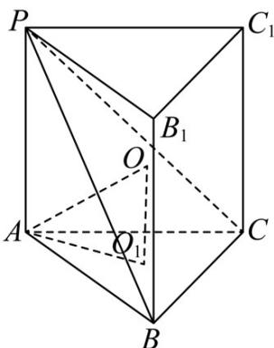

> [!faq]- 《专题14_简单几何体的表面积和体积_高效培优期中专项训练_数学人教A版》官方解析
>
> > [!success]- **【答案】** D
>
> > [!note]- **【解析】**
> > 因为 PA = 2 ，当点 P 到平面 ABC 的距离取最大值时，则 $PA \perp$ 平面 ABC ，又 AB = BC = CA = 1 ，所以 VABC 为等边三角形，
> > 过点 P 作与平面 ABC 平行的平面 $PB_{1}C_{1}$ ， $BB_{1} \parallel PA, CC_{1} \parallel PA$ ，得到正三柱 $PB_{1}C_{1} - ABC$ ，则三棱锥 P - ABC 的外接球即为正三棱柱 $PB_{1}C_{1} - ABC$ 的外接球，如图：
> >
> > 
> >
> > $$
> > A O _ {1} = \frac {2}{3} \times \frac {\sqrt {3}}{2} = \frac {\sqrt {3}}{3}
> > $$
> >
> > 设外接球半径为 $R$ ，则 $R^{2} = AO^{2} = \left(\frac{\sqrt{3}}{3}\right)^{2} + 1^{2} = \frac{4}{3}$ ，
> > 所以球 O 的表面积 $S = 4\pi R^{2} = \frac{16}{3}\pi$ .
> >
> > 故选：D.
> >
> > ## 考点06球的体积的相关计算
