> [!faq]- 《专题14_简单几何体的表面积和体积_高效培优期中专项训练_数学人教A版》官方解析
>
> > [!success]- **【答案】** 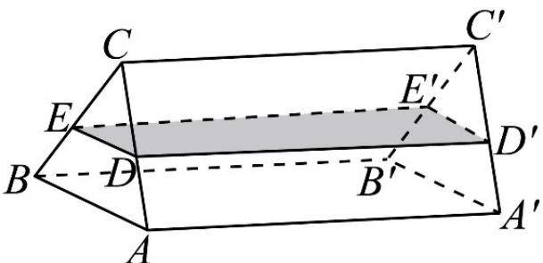 A. 1 B. 2 C. 3 D. 4
>
> > [!note]- **【解析】**
> > 依题意只需放入小铁球的总体积大于 $V_{CDE-CD'E'} = \frac{1}{2} CD \cdot CE \sin 60^\circ \cdot AA' = 48\sqrt{3}$ 即可，而小铁球的体积 $V' = \frac{4}{3} \times \pi \times 2^3 = \frac{32}{3}\pi$ ，
> >
> > 若放入 $n$ 个小铁球水从上底面 $A'B'C'$ 溢出，所以 $\frac{32}{3}\pi \times n > 48\sqrt{3}$
> >
> > 则 $n > \frac{9\sqrt{3}}{2\pi} \approx 2.48$ ，而 $n \in \mathbf{N}^*$ ，故 $n$ 最小为 3.
> >
> > 故选：C.
> >
> > ## 考点 07 求组合多面体的表面积
> >
> > 37. 半正多面体亦称“阿基米德多面体”，是由边数不全相同的正多边形为面的多面体，体现了数学的对称美。如图，将正方体沿交于一顶点的三条棱的中点截去一个三棱锥，如此共可截去八个三棱锥，得到一个有十四个面的半正多面体，它们的棱长都相等，其中八个为正三角形，六个为正方形，称这样的半正多面体为二十四等边体。一个二十四等边体的各个顶点都在同一个球面上，若该球的表面积为 $16\pi$ ，则该二十四等边体的表面积为 \_\_\_\_。
> >
> > 【答案】
> >
> > 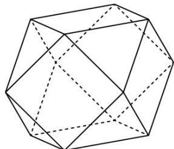
> >
> > 【答案】 $24+8\sqrt{3}/8\sqrt{3}+24$
> >
> > 【详解】由于二十四等边体的外接球表面积为 $16\pi$
> >
> > 设其半径为 r，则 $4\pi r^{2} = 16\pi$ ，解得 r = 2。
> >
> > 设 O 为球心，依题意可知四边形 A，B，C，D 分别为正方体侧棱的中点，
> >
> > 所以 ABCD 为正方形，
> >
> > 由于 $OA = OB = OC = OD = 2$ ， $AB = \sqrt{OA^2 + OB^2} = 2\sqrt{2}$
> >
> > 所以二十四等边体的边长为 $^{2}$ .
> >
> > 所以二十四等边体的边长的表面积为 $2 \times 2 \times 6 + \frac{1}{2} \times 2 \times 2 \times \sin \frac{\pi}{3} \times 8 = 24 + 8\sqrt{3}$ .
> >
> > 故答案为： $24+8\sqrt{3}$
> >
> > 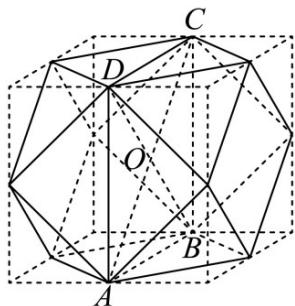
> >
> > 38. 清初著名数学家孔林宗曾提出一种“蒺藜形多面体”，其可由两个正交的全等正四面体组合而成（每一个四面体的各个面都过另一个四面体的三条共点的棱的中点）·如图，若正四面体棱长为 $^{2}$ ，则该组合体的表面积为 \_\_\_\_；该组合体的外接球体积与两正交四面体公共部分的内切球体积的比值为 \_\_\_\_。
> >
> > 【答案】
> >
> > 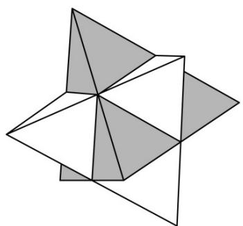
> >
> > 【答案】 $6\sqrt{3}$ 27
> >
> > 【详解】该组合体一共有 $^{24}$ 个面，每一个面都是全等的边长为 $^{1}$ 的等边三角形，
> >
> > 则其表面积为 $24 \times \frac{1}{2} \times 1 \times 1 \times \sin \frac{\pi}{3} = 6\sqrt{3}$ ;
> >
> > 该组合体的外接球也是任意一个正四面体的外接球，可用一个正四面体来看，
> >
> > 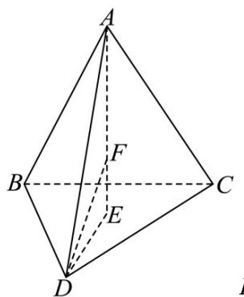
> >
> > 是    的中心，    是球心，
> >
> > $E$ $\triangle BCD$ $F$
> >
> > 则 $2DE\cos \frac{\pi}{6} = DC$ ，则 $DE = \frac{2\sqrt{3}}{3}$ ， $AE = \sqrt{2^2 - \left(\frac{2\sqrt{3}}{3}\right)^2} = \frac{2\sqrt{6}}{3}$
> >
> > 设外接球半径为 $R$ ，则 $AF = DF = R$
> >
> > 又 $AF + EF = AE,DF^2 = EF^2 +DE^2$ ，解得 $R = \frac{\sqrt{6}}{2}$
> >
> > 两正交四面体公共部分一共有 $^{8}$ 个面，且每一个面都是全等的边长为 $^{1}$ 的等边三角形，则其表面积为 $8 \times \frac{1}{2} \times 1 \times 1 \times \sin \frac{\pi}{3} = 2\sqrt{3}$ ，大正四面体的体积为 $\frac{1}{3} \times \frac{1}{2} \times 2 \times 2 \times \sin \frac{\pi}{3} \times \frac{2\sqrt{6}}{3} = \frac{2\sqrt{2}}{3}$ ，则每个小正四面体的体积为 $\frac{2\sqrt{2}}{3} \times \left( \frac{1}{2} \right)^{3} = \frac{\sqrt{2}}{12}$ ，则中间部分的体积为 $\frac{2\sqrt{2}}{3} - 4 \times \frac{\sqrt{2}}{12} = \frac{\sqrt{2}}{3}$ ，设其内切球半径为 $r$ ，则中间部分的体积也可表示为 $\frac{1}{3} \times 2\sqrt{3}r = \frac{\sqrt{2}}{3}$ ，解得 $r = \frac{\sqrt{6}}{6}$ ，故外接球和内切球体积之比为 $\left( \frac{R}{r} \right)^{3} = 27$ 故答案为： $6\sqrt{3}$ ； $27 \cdot$
> >
> > 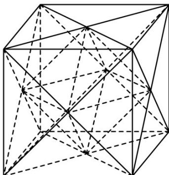
> >
> > 39. 球面被平面所截得的一部分叫做球冠（如图）·球冠是曲面，是球面的一部分·截得的圆叫做球冠的底，垂直于截面的直径被截得的一段叫做球冠的高·阿基米德曾在著作《论球与圆柱》中记录了一个被后人称作“Archimedes’Hat-BoxTheorem”的定理：球冠的表面积 $= 2\pi Rh$ （如上图，这里的表面积不含底面的圆的面积）·某同学制作了一个工艺品，如下图所示·该工艺品可以看成是一个球被一个棱长为 $^{4}$ 的正方体的六个面所截后剩余的部分（球心与正方体的中心重合），即一个球去掉了 $^{6}$ 个球冠后剩下的部分·若其中一个截面圆的周长为 $2\pi$ ，则该工艺品的表面积为（）
> >
> > 【答案】
> >
> > 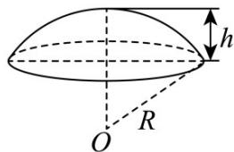
> >
> > 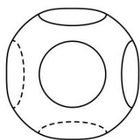
> >
> > A. $20\pi$ B. $(24\sqrt{5} - 34)\pi$ C. $16\pi$ D. $12\pi$
> >
> > 【答案】B
> >
> > 【详解】设截面圆半径为 r，球的半径为 R，
> > 则球心到某一截面的距离为正方体棱长的一半即此距离为 2，
> > 根据截面圆的周长可得 $2\pi = 2\pi r$ ，得 r = 1，故 $R^{2} = 2^{2} + 1^{2} = 5$ ，得 $R = \sqrt{5}$ ，
> > 所以球的表面积 $S = 20\pi$ .
> > 如图， $OA = OB = R = \sqrt{5}$ ，且 $OO_{2} = 2$ ，则球冠的高 $h = R - OO_{2} = \sqrt{5} - 2$ ，
> > 得所截的一个球冠表面积 $S_{1}=2\pi Rh=2\pi\times\sqrt{5}\times(\sqrt{5}-2)=10\pi-4\sqrt{5}\pi$ 且截面圆面积为 $\pi\times1^{2}=\pi$ 所以工艺品的表面积 $S' = S - 6S_{1} + 6\pi = 20\pi - 60\pi + 24\sqrt{5}\pi + 6\pi = (24\sqrt{5} - 34)\pi$ 故选：B.
> >
> > 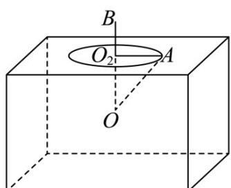
> >
> > 40．六氟化硫，化学式为 $SF_{6}$ ，在常压下是一种无色、无臭、无毒、不燃的稳定气体，有良好的绝缘性，在电器工业方面具有广泛用途．六氟化硫结构为正八面体结构，如图所示，硫原子位于正八面体的中心，6个氟原子分别位于正八面体的6个顶点，若相邻两个氟原子之间的距离为 m，则（）
> >
> > 【答案】
> >
> > 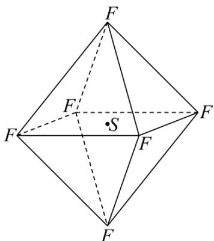
> >
> > A．该正八面体结构的表面积为 $2\sqrt{3} m^2$ B．该正八面体结构的体积为 $\sqrt{2} m^3$
> >
> > C．该正八面体结构的外接球表面积为 $2\pi m^2$ D．该正八面体结构的内切球表面积为 $\frac{2\pi m^2}{3}$
> >
> > 【答案】ACD
> >
> > 【详解】
> >
> > 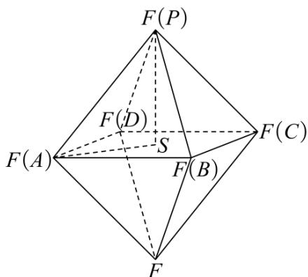
> >
> > 对 $^{A}$ ：由题知，各侧面均为边长为 m 的正三角形，
> >
> > 故该正八面体结构的表面积 $S = 8 \times \frac{\sqrt{3}}{4} \times m^{2} = 2\sqrt{3}m^{2}$ ，故 A 正确；
> >
> > 对 B：连接 AS, PS，则 $AS = PS = \frac{\sqrt{2}}{2} m$ ， $PS \perp$ 底面 ABCD，
> >
> > 故该正八面体结构的体积 $V = 2 \times \frac{1}{3} \times m^{2} \times \frac{\sqrt{2}}{2} m = \frac{\sqrt{2}}{3} m^{3}$ ，故 B 错误；
> >
> > 对 $C$ ：底面中心 $\mathrm{S}$ 到各顶点的距离相等，故 $\mathrm{S}$ 为外接球球心，外接球半径 $R = PS = \frac{\sqrt{2}}{2} m$
> >
> > 故该正八面体结构的外接球表面积 $S' = \pi \times (\sqrt{2} m)^2 = 2\pi m^2$ ，故C正确；
> >
> > 对 D：该正八面体结构的内切球半径 $r=\frac{3V}{S}=\frac{\sqrt{2}m^{3}}{2\sqrt{3}m^{2}}=\frac{\sqrt{2}m}{2\sqrt{3}}$
> >
> > 故内切球的表面积 $S'' = 4\pi \times \left( \frac{\sqrt{2}m}{2\sqrt{3}} \right)^{2} = \frac{2\pi m^{2}}{3}$ ，故 D 正确；
> >
> > 故选 **ACD**
