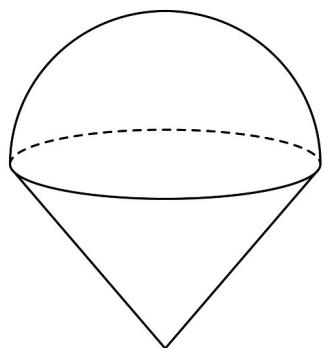
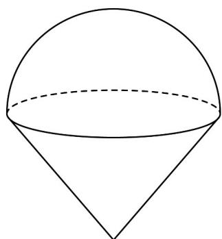

> [!faq]- 《专题14_简单几何体的表面积和体积_高效培优期中专项训练_数学人教A版》官方解析
>
> > [!success]- **【答案】** 
>
> > [!note]- **【解析】**
> > 解：如图所示，
> >
> > 
> >
> > 该组合体的表面积是： $S = S_{半球} + S_{圆锥侧} = 2\pi \times 1^{2} + \pi \times 1 \times \sqrt{1^{2} + 2^{2}} = 2\pi + \sqrt{5}\pi$ ;
> >
> > 体积是 $V = V_{\text{半球}} + V_{\text{圆锥}} = \frac{2\pi}{3} \times 1^3 + \frac{\pi}{3} \times 1^2 \times 2 = \frac{4\pi}{3}$
> >
> > 故答案为： $2\pi + \sqrt{5}\pi$ ; $\frac{4\pi}{3}$ .
