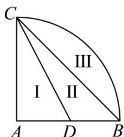

> [!faq]- 《专题14_简单几何体的表面积和体积_高效培优期中专项训练_数学人教A版》官方解析
>
> > [!success]- **【答案】**  A. 1:2:2 B. 1:2:3 C. 1:3:3 D. 1:3:4
>
> > [!note]- **【解析】**
> > 由题意，不妨设扇形 ABC 的半径为 $^{2}$ ，
> >
> > 则 $V_{1} = \frac{1}{3}\pi \times 1^{2}\times 2 = \frac{2\pi}{3}, V_{2} = \frac{1}{3}\pi \times 2^{2}\times 2 - \frac{1}{3}\pi \times 1^{2}\times 2 = 2\pi$
> >
> > $$
> > V _ {3} = \frac {1}{2} \times \frac {4}{3} \pi \times 2 ^ {3} - \frac {1}{3} \pi \times 2 ^ {2} \times 2 = \frac {8 \pi}{3}
> > $$
> >
> > 故 $V_{1}:V_{2}:V_{3}=\frac{2\pi}{3}:2\pi:\frac{8\pi}{3}=1:3:4$
> >
> > 故选 **D**
