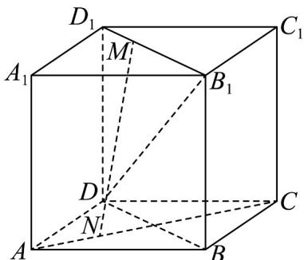

<!-- question-source:start -->
1. 已知正方体 $ABCD - A_1B_1C_1D_1$ 中，点 $M$ 为线段 $D_1B_1$ 上的动点，点 $N$ 为线段 $AC$ 上的动点，则与线段 $DB_1$ 相交且互相平分的线段 $MN$ 有 \_\_\_\_ 条·

<!-- question-source:end -->

![[高中/课堂同步/题库/人教A版高中数学同步讲义(2026)/02_必修第二册/期中专项训练+期中模拟卷/专项训练/专题15_空间点_直线_平面之间的位置关系_高效培优期中专项训练_数学/_compact/answers/Q00064149A1.md]]
