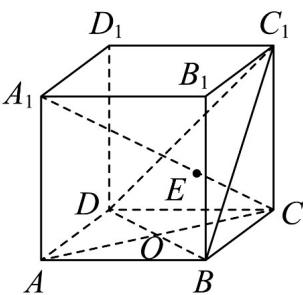
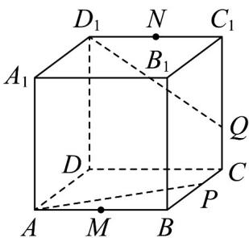
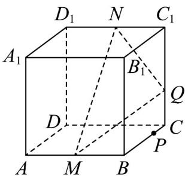

<!-- question-source:start -->
7. 在正方体 $ABCD - A_{1}B_{1}C_{1}D_{1}$ 中.

图1

图2

图3

(1)如图 1，若 $AC \cap BD = O, A_{1}C \cap$ 平面 $BDC_{1} = E$ ，求证： $C_{1}, E, O$ 三点共线；

(2) $M, N$ 分别为 $AB$ 和 $C_1D_1$ 的中点， $P, Q$ 分别为 $BC$ 和 $CC_1$ 的一个三等分点（都靠近 $C$ 端）.

①如图 $^{2}$ ，求证：AP, DC, $D_{1}Q$ 三线共点；

②过点 $M, N, Q$ 三点作该正方体的截面，在图3中画出这个截面（不必说明画法和理由，但要保留作图痕迹）.
<!-- question-source:end -->

![[高中/课堂同步/题库/人教A版高中数学同步讲义(2026)/02_必修第二册/期中专项训练+期中模拟卷/专项训练/专题15_空间点_直线_平面之间的位置关系_高效培优期中专项训练_数学/_compact/answers/Q00064155A1.md]]
