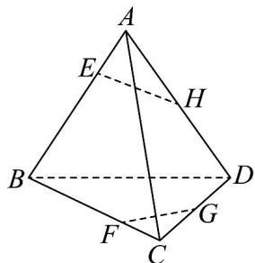

<!-- question-source:start -->
8. 在四面体 $ABCD$ 中， $H$ 、 $G$ 分别是 $AD$ 、 $CD$ 的中点，点 $E$ 、 $F$ 分别是 $AB$ 、 $BC$ 边上的点，且 $\frac{BF}{FC} = \frac{BE}{EA} = k(k > 0)$ 。

(1)求证： $E$ 、 $F$ 、 $G$ 、 $H$ 四点共面；

(2)若四面体 $ABCD$ 为棱长为 $6$ 的正四面体，且 $k = 2$ ，求四边形 $EFGH$ 的周长；

(3)若平面 $EFGH$ 截四面体 $ABCD$ 所得的五面体 $AC-EFGH$ 的体积占四面体 $ABCD$ 的 $\frac{3}{25}$ ，求 $k$ 的值。
<!-- question-source:end -->

![[高中/课堂同步/题库/人教A版高中数学同步讲义(2026)/02_必修第二册/期中专项训练+期中模拟卷/专项训练/专题15_空间点_直线_平面之间的位置关系_高效培优期中专项训练_数学/_compact/answers/Q00064156A1.md]]
