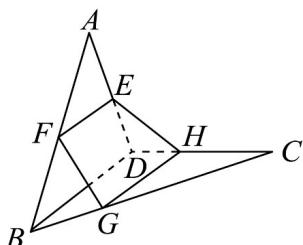

<!-- question-source:start -->
18. 如图，空间四边形 $ABCD$ 中， $E, F$ 分别是 $AD, AB$ 的中点， $G, H$ 分别在 $BC, CD$ 上，且 $BG: GC = DH: HC = 1: 2$ .

(1)求证： $E,F,G,H$ 四点共面；

(2)设 $FG$ 与 $HE$ 交于点 $P$ ，求证： $P,A,C$ 三点共线.
<!-- question-source:end -->

![[高中/课堂同步/题库/人教A版高中数学同步讲义(2026)/02_必修第二册/期中专项训练+期中模拟卷/专项训练/专题15_空间点_直线_平面之间的位置关系_高效培优期中专项训练_数学/_compact/answers/Q00064164A1.md]]
