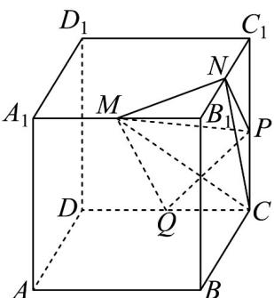

<!-- question-source:start -->
23. 如图，在长方体 $ABCD - A_1B_1C_1D_1$ 中， $AB = BC = 4$ ， $AA_1 = 3$ ，点 $M, N, P$ ， $Q$ 分别是棱 $A_1B_1, B_1C_1, CC_1, CD$ 的中点。

(1)证明：三条直线 $MN, QP, D_1C_1$ 相交于同一点

(2)求三棱锥 $C - MNP$ 的体积.
<!-- question-source:end -->

![[高中/课堂同步/题库/人教A版高中数学同步讲义(2026)/02_必修第二册/期中专项训练+期中模拟卷/专项训练/专题15_空间点_直线_平面之间的位置关系_高效培优期中专项训练_数学/_compact/answers/Q00064169A1.md]]
