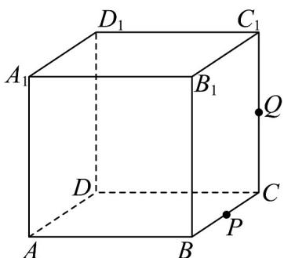

<!-- question-source:start -->
33. 已知正方体 $ABCD - A_{1}B_{1}C_{1}D_{1}$ 的棱长为 3，

(1)求四棱锥 $A - BB_{1}D_{1}D$ 的体积；

(2)若点 $P$ ， $Q$ 分别为 $BC$ ， $CC_{1}$ 的中点，求过点 $A_{1}$ ， $P$ ， $Q$ 的平面截正方体所得的截面的周长.
<!-- question-source:end -->

![[高中/课堂同步/题库/人教A版高中数学同步讲义(2026)/02_必修第二册/期中专项训练+期中模拟卷/专项训练/专题15_空间点_直线_平面之间的位置关系_高效培优期中专项训练_数学/_compact/answers/Q00064178A1.md]]
