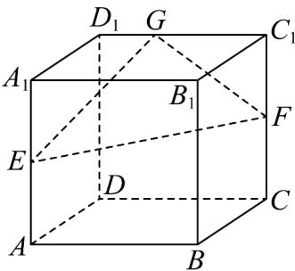

<!-- question-source:start -->
34. 如图，正方体 $ABCD - A_1B_1C_1D_1$ 的棱长为 1， $E$ ， $F$ 分别为 $AA_1$ ， $CC_1$ 的中点， $G$ 在 $D_1C_1$ 上，且

$D_{1}G = \frac{1}{2} GC_{1}$ ，平面 $EFG$ 与棱 $B_{1}B$ 所在直线交于点 $H$ ，则 $BH = (\quad)$

A. $\frac{2}{5}$ B. $\frac{1}{3}$ C. $\frac{1}{4}$ D. $\frac{1}{6}$
<!-- question-source:end -->

![[高中/课堂同步/题库/人教A版高中数学同步讲义(2026)/02_必修第二册/期中专项训练+期中模拟卷/专项训练/专题15_空间点_直线_平面之间的位置关系_高效培优期中专项训练_数学/_compact/answers/Q00064179A1.md]]
