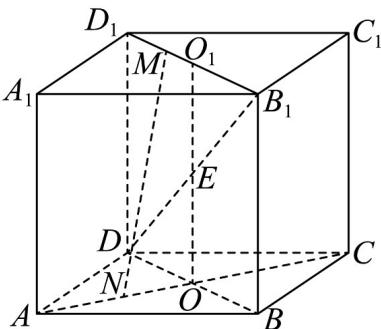

> [!faq]- 《专题15_空间点_直线_平面之间的位置关系_高效培优期中专项训练_数学》官方解析
>
> > [!success]- **【答案】** 1
>
> > [!note]- **【解析】**
> > 在正方体 $ABCD - A_{1}B_{1}C_{1}D_{1}$ 中， $M \in D_{1}B_{1}$ ，而 $D_{1}B_{1} \subset$ 平面 $D_{1}B_{1}D$ ，即有 $M \in$ 平面 $D_{1}B_{1}D$ 又 $MN$ 与线段 $DB_{1}$ 相交，则交点必在直线 $DB_{1}$ 上，而 $DB_{1} \subset$ 平面 $D_{1}B_{1}D$ ，于是 $MN \subset$ 平面 $D_{1}B_{1}D$ ， $N \in$ 平面 $D_{1}B_{1}D$ ，
> > 而 $N \in AC$ ， $AC \subset$ 平面 $ABCD$ ，即 $N \in$ 平面 $ABCD$ ，而平面 $D_{1}B_{1}D \cap$ 平面 $ABCD = BD$ ，
> > 因此 $N \in BD$ ，即点 $N$ 为 $AC, BD$ 的交点 $O$ ，又线段 $DB_{1}$ 与 $MN$ 互相平分，
> > 取 $DB_{1}$ 的中点 $E$ ，连接 $OE$ 并延长交 $D_{1}B_{1}$ 于 $O_{1}$ ，显然 $EO //BB_{1} //DD_{1}$ ，于是 $O_{1}$ 为 $D_{1}B_{1}$ 的中点，
> > 所以当点 $N$ 与 $O$ 重合，点 $M$ 与 $O_{1}$ 重合时， $MN$ 与线段 $DB_{1}$ 相交且互相平分，这样的直线 $MN$ 只有 $^{1}$ 条·
> > 故答案为： $^{1}$
> >
> > 
