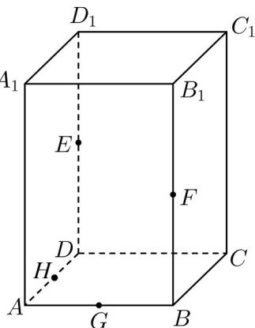
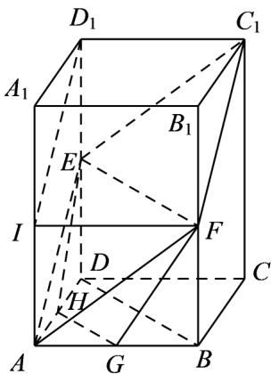

> [!faq]- 《专题15_空间点_直线_平面之间的位置关系_高效培优期中专项训练_数学》官方解析
>
> > [!success]- **【答案】**  A. 点 $A$ 在平面 $EFC_{1}$ 内 B. $EH // C_{1}F$ C. 平面 $EFC_{1} \cap$ 平面 $ABCD = HG$ D. 直线 $EH$ 与直线 $FG$ 相交
>
> > [!note]- **【解析】**
> > 连接 $EC_{1}$ 、 $FC_{1}$ 、AF、AE，若I是 $AA_{1}$ 的中点，连接 $ID_{1}$ 、IF，由题设， $IF // D_{1}C_{1}$ 且 $IF = D_{1}C_{1}$ ，则 $IFC_{1}D_{1}$ 为平行四边形，所以 $ID_{1} // FC_{1}$ 且 $ID_{1} = FC_{1}$ ，又 $E$ 是 $DD_{1}$ 中点，故 $AI // ED_{1}$ 且 $AI = ED_{1}$ ，则 $IAED_{1}$ 为平行四边形，所以 $ID_{1} // AE$ 且 $ID_{1} = AE$ ，综上， $FC_{1} // AE$ 且 $FC_{1} = AE$ ，故 $F, C_{1}, A, E$ 共面，A 正确；
> >
> > 
> >
> > 由过直线外一点有且仅有一条直线与该直线平行，且 $FC_{1} / / AE$ ，不可能有 $EH / / C_1F$ ，B错误；
> >
> > 由 $A \in$ 面 $ABCD$ ， $A \in$ 面 $EFC_1$ ，故 $A \in$ 面 $EFC_1 \cap$ 面 $ABCD$ ，又 $HG \subset$ 面 $ABCD$ ，而 $A \notin HG$ ，故平面 $EFC_1 \cap$ 平面 $ABCD \neq HG$ ，C 错误；
> >
> > 连接 $BD$ ，又 $G$ 、 $H$ 分别是 $AB$ 、 $AD$ 的中点，则 $HG // BD$ 且 $HG = \frac{1}{2} BD$
> >
> > $$
> > D D _ {1} \quad B B _ {1}
> > $$
> >
> > $$
> > E F / / B D
> > $$
> >
> > $$
> > E F = B D
> > $$
> >
> > 所以 $EF // HG$ ，即 $E, F, H, G$ 共面，且 $HG = \frac{1}{2} EF$ ，故直线 $EH$ 与直线 $FG$ 相交， $D$ 正确。
