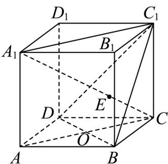
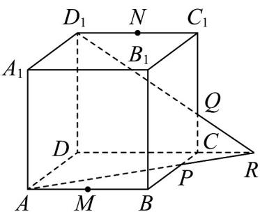
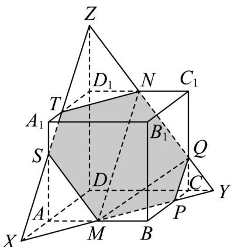

> [!faq]- 《专题15_空间点_直线_平面之间的位置关系_高效培优期中专项训练_数学》官方解析
>
> > [!success]- **【答案】** $^{(1)}$ 证明见解析 (2)① 证明见解析；②答案见解析
>
> > [!note]- **【解析】**
> > （1）证明：如图，连接 $A_{1}C_{1}$
> >
> > $\because C_{1} \in$ 面 $A_{1}ACC_{1}$ ，且 $C_{1} \in$ 面 $BDC_{1}, \therefore C_{1}$ 是面 $A_{1}ACC_{1}$ 与面 $BDC_{1}$ 的公共点，
> >
> > ∵ $AC \cap BD = O, A_{1}C$ 面 $BDC_{1} = E$
> >
> > $\therefore O \in AC, AC \subset \text{面} A_{1}ACC_{1}, O \in BD, BD \subset \text{面} BDC_{1}$
> >
> > ∴ O 是面 $A_{1}ACC_{1}$ 与面 $BDC_{1}$ 的公共点，
> >
> > ∴ 面 $A_{1}ACC_{1} \cap$ 面 $BDC_{1} = OC_{1}$
> >
> > 又 $E\in A_1C,A_1C\subset$ 面 $A_{1}ACC_{1},E\in \text{面} BDC_{1}$
> >
> > $\therefore E$ 是面 $A_{1}ACC_{1}$ 与面 $BDC_{1}$ 的公共点，
> >
> > $\therefore E \in OC_{1}$ ，即 $C_{1}, E, O$ 三点共线。
> >
> > 
> >
> > (2) ①证明：如图，分别延长 $AP, DC$ 交于点 $R$ ，连接 $D_{1}R$ ， $\because R \in \text{直线 } DC, DC \subset \text{面 } ABCD, PC = \frac{1}{3} AD, BC // AD$ ， $\therefore CR = \frac{1}{3} DR$ ，
> >
> > 又 $D_{1}D // C_{1}C$ ， $\therefore D_{1}R$ 与 $C_{1}C$ 的交点为 $C_{1}C$ 的三等分点，即点 $Q$ ， $\therefore AP, DC, D_{1}Q$ 三线共点.
> >
> > 
> > - **②**：解：如图，六边形 MPONTS 即为所求作的截面。
> >
> > 
