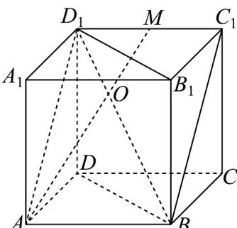
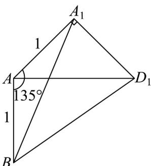

> [!faq]- 《专题15_空间点_直线_平面之间的位置关系_高效培优期中专项训练_数学》官方解析
>
> > [!success]- **【答案】** A. 若 $M$ 是 $C_{1}D_{1}$ 的中点， $AM$ 与平面 $BB_{1}D_{1}D$ 的交点为 $O$ ，则 $A_{1}, O, C$ 三点共线 B. 以正方体的四个顶点为顶点组成的正四面体的体积为 $\frac{1}{3}$ C. 若 $P$ 是 $B_{1}D_{1}$ 上的动点，则 $D, P, B, C_{1}$ 四点共面 D. 若 $Q$ 是 $AD_{1}$ 上的动点，则 $A_{1}Q + QB$ 的最小值是 $\sqrt{2 + \sqrt{3}}$
>
> > [!note]- **【解析】**
> > 选项 A，在正方体 $ABCD - A_{1}B_{1}C_{1}D_{1}$ 中，连接 $AD_{1}$ ， $BC_{1}$ ，如图， $C_{1}D_{1} // CD // AB$ ，故 $ABC_{1}D_{1}$ 共面，
> >
> > 连接 $BD_{1}$ ，平面 $ABC_{1}D_{1}\cap$ 平面 $BB_{1}D_{1}D = BD_{1}$ ，因为 $M$ 为棱 $D_{1}C_{1}$ 的中点，则 $M\in$ 平面 $ABC_{1}D_{1}$
> >
> > 
> >
> > 而 $A \in$ 平面 $ABC_{1}D_{1}$ ，即 $AM \subset$ 平面 $ABC_{1}D_{1}$ ，又 $O \in AM$ ，则 $O \in$ 平面 $ABC_{1}D_{1}$ ，
> > 因 $AM$ 与平面 $BB_{1}D_{1}D$ 的交点为 $O$ ，则 $O \in$ 平面 $BB_{1}D_{1}D$ ，于是得 $O \in BD_{1}$ ，即 $D_{1}$ ， $O$ ， $B$ 三点共线，
> > 由 $C_{1}D_{1}//CD//AB$ ， $M$ 为棱 $D_{1}C_{1}$ 的中点，可得 $D_{1}M\| AB$ 且 $D_{1}M = \frac{1}{2} D_{1}C_{1} = \frac{1}{2} AB$ ，故 $\triangle OMD_{1} - \triangle OAB$ ，
> > 于是得 $OD_{1} = \frac{1}{2} OB$ ，即 $OB = 2OD_{1}$ ，所以三点 $D_{1}$ ， $O$ ， $B$ 共线，且 $OB = 2OD_{1}$ 。
> > 而 $A_{1}C$ 与 $BD_{1}$ 交于 $BD_{1}$ 的中点，所以三点 $A_{1}$ ， $O$ ， $C$ 不共线，故 $A$ 错误；
> > 选项 $^{B}$ ，以正方体的四个顶点为顶点组成的正四面体，例如四面体 $B_{1} - D_{1}AC$ 的体积为 $V = V_{ABCD - A_{1}B_{1}C_{1}D_{1}} - 4V_{B_{1} - ABC} = 1 - 4 \times \frac{1}{6} = \frac{1}{3}$ ，故 $^{B}$ 正确；
> > 选项 $^{C}$ ，设直线 $DP$ 与直线 $BB_{1}$ 相交于点 $N$ ，直线 $BC_{1}$ 在平面 $BB_{1}C_{1}C$ 内，且不过点 $N$ ，所以由线线位置关系知，直线 $DP$ 与 $BC_{1}$ 是异面直线，故 $^{C}$ 错误；
> >
> > 选项D，如图，将平面 $A_{1}AD_{1}$ 和平面 $BAD_{1}$ 展开到一个平面上，连接 $A_{1}B$ 交 $AD_{1}$ 于点 $Q$ ，此时 $A_{1}Q + QB$ 最小在 $\triangle A_{1}AB$ 中， $A_{1}A = AB = 1$ ， $\angle A_{1}AB = \frac{3\pi}{4}$ ，由余弦定理可知 $A_{1}B = \sqrt{1 + 1 - 2\times 1\times 1\times\left(-\frac{\sqrt{2}}{2}\right)} = \sqrt{2 + \sqrt{2}}$ 故D错误
> >
> > 故选：B.
> >
> > 
