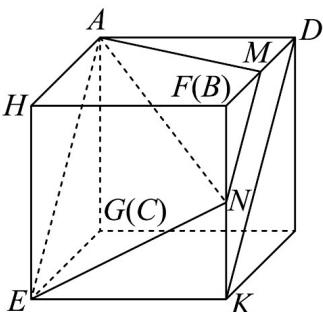
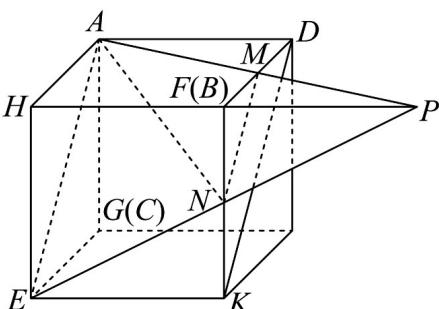

> [!faq]- 《专题15_空间点_直线_平面之间的位置关系_高效培优期中专项训练_数学》官方解析
>
> > [!success]- **【答案】** (1)证明见解析； (2)三棱台， $V_{1}:V_{2}=7:17$
>
> > [!note]- **【解析】**
> > （1）证明：将展开图还原为如图所示的正方体，连接 $MN$ ，在正方体中， $\because AD//EK$ 且 $AD = EK$ ，
> > ∴四边形ADKE是平行四边形， $\therefore AE//DK$ ，
> > 由 $M,N$ 分别是棱DB,KF的中点，有 $MN//DK$ ，则 $MN//AE$ ，所以 $M,N,E,A$ 四点共面，即点 $M$ 在平面 $AEN$ 内．
> >
> > 
> >
> > (2) 连接 $AM$ ，所以平面 $AEN$ 截正方体的截面是四边形 $AENM$
> >
> > 
> >
> > 平面 AHBD 中，延长 AM 与 HB 的延长线交于点 P，M 是棱 DB 中点，则 B 为 HP 中点，
> > N 为 KF 中点，则延长 EN 与 HB 的延长线交于点 P，
> > 所以体积较小的几何体，即体积为 $V_{1}$ 的几何体是三棱台 AHE-MFN，
> > 正方体的体积 $V = 2^{3} = 8$ ，其中 $V_{1}$ 是三棱台 AHE-MFN 的体积， $\because V_{1}=\frac{1}{3}\cdot HF\cdot\left(S_{\triangle AHE}+\sqrt{S_{\triangle AHE}S_{\triangle MFN}}+S_{\triangle MFN}\right)=\frac{1}{3}\times2\left(2+\sqrt{2\times\frac{1}{2}}+\frac{1}{2}\right)=\frac{7}{3}$ $\therefore V_{2}=V-V_{1}=\frac{17}{3}$ $\therefore V_{1}:V_{2}=7:17$
