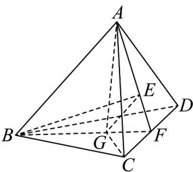
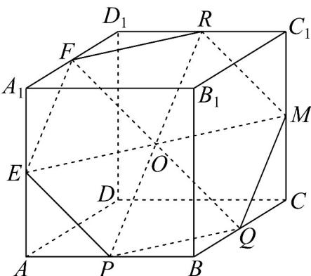

> [!faq]- 《专题15_空间点_直线_平面之间的位置关系_高效培优期中专项训练_数学》官方解析
>
> > [!success]- **【答案】** A. 直线 $BG, AE$ 共面 B. 直线 $AG, BE$ 相交 C. $V_{A-GBC} = \frac{1}{2} V_{A-DBC}$ D. $AB = 3GE$
>
> > [!note]- **【解析】**
> > 
> >
> > 由于 G, E 分别是 $\triangle BCD, \triangle ACD$ 的重心，所以分别延长 BG, AE 交 CD
> >
> > 于中点 $F$ ·因此A正确·
> >
> > 因为 $BG:GF = 2:1, AE:EF = 2:1$ ，所以 $BG:GF = AE:EF = 2:1$ ，因此 $GE \parallel AB$ .
> >
> > 直线 AG, BE 相交，B 正确.
> >
> > 因为 G 是 $\triangle BCD$ 的重心，所以 $S_{\triangle GBC} = \frac{1}{3} S_{\triangle DBC}$ ，因此 $V_{A-GBC} = \frac{1}{3} V_{A-DBC}$ ，C 不正确。
> > 因为 $GE \parallel AB$ ，所以 AB:GE = BF:GF = 3:1·因此 AB = 3GE，D 正确·
> >
> > 故选：ABD.
> >
> > 12．一封闭的正方体容器 $ABCD-A_{1}B_{1}C_{1}D_{1}$ ，P，Q，R 分别是 AB，BC 和 $C_{1}D_{1}$ 的中点，由于某种原因，P，Q，R 处各有一个小洞，当此容器内存水的表面恰好经过这三个小洞时，容器中水的上表面形状是（）A．三角形 B．四边形 C．五边形 D．六边形
> >
> > 【答案】D
> >
> > 【详解】
> >
> > 
> >
> > 如图，设过 P, Q, R 三点的平面为平面 $\alpha$ .
> >
> > 分别取 $A_{1}D_{1}$ ， $A_{1}A$ ， $CC_{1}$ 的中点 F，E，M，
> >
> > 连接 $RF, FE, EP, PQ, QM, MR, EM, QF, RP$ .
> >
> > 由正方体性质知 $RF//PQ$ ，所以 $F \in$ 平面 $\alpha$ .
> >
> > 又 $RP//MQ$ ，所以 $M \in$ 平面 $\alpha$
> >
> > 又 $EF // RP$ ，所以 $E \in$ 平面 $\alpha$
> >
> > 所以点六边形 RFEPQM 为容器中水的上表面的形状.
> >
> > 故选：D.
> >
> > ## 考点03空间中的点共线问题
