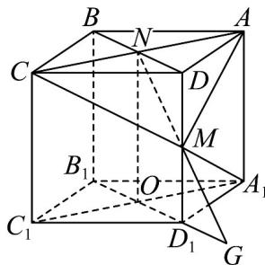

> [!faq]- 《专题15_空间点_直线_平面之间的位置关系_高效培优期中专项训练_数学》官方解析
>
> > [!success]- **【答案】** A．过空间中任意三点有且仅有一个平面 B．两两相交且不过同一点的三条直线必在同一平面内 C．若空间两条直线不相交，则这两条直线平行 D．空间四点不共面，则任意三点不共线
>
> > [!note]- **【解析】**
> > 对于 $A$ ，当三点在一条直线上时，过这三点有无数个平面，错误；对于 $B$ ，两两相交且不过同一点的三条直线必在同一平面内，正确；对于 $C$ ，若空间两条直线不相交，则这两条直线平行或异面，错误；对于 $D$ ，空间四点不共面，则任意三点不共线，正确。
> >
> > 故选：BD.
> >
> > 17．正方体 $ABCD-A_{1}B_{1}C_{1}D_{1}$ 棱长为 2，N 为线段 AC 上一动点，M 为线段 $DD_{1}$ 上一动点，则 $A_{1}M+MN$ 的最小值为 \_\_\_\_.
> >
> > 【答案】 $\sqrt{10 + 4\sqrt{2}} / \sqrt{4\sqrt{2} + 10}$
> >
> > 【详解】如图，连接 MC, MA,
> >
> > 则由题意可知当 $\triangle MCA$ 为等腰三角形，当 MN 垂直于 AC 时 MN 最短，
> >
> > 此时 $N$ 为 $AC$ 中点， $MN \subset$ 面 $DD_{1}B_{1}B$
> >
> > 如图延长 $B_{1}D_{1}$ 至 G，使得 $D_{1}G = D_{1}A_{1}$ ，连接 GM，
> >
> > 则 $MG \subset$ 面 $DD_{1}B_{1}B$ ，且 $GM = A_{1}M$ ，
> >
> > 所以 $M, G, N \subset$ 面 $DD_{1}B_{1}B$ ，故当三点共线时 $A_{1}M + MN = GM + MN$ 最小，
> >
> > 此时 $A_{1}M + MN = GM + MN = \sqrt{ON^{2} + OG^{2}} = \sqrt{2^{2} + (2 + \sqrt{2})^{2}} = \sqrt{10 + 4\sqrt{2}}$
> >
> > 故答案为： $\sqrt{10+4\sqrt{2}}$
> >
> > 
