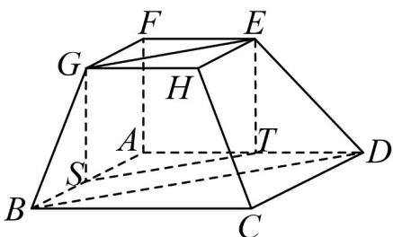
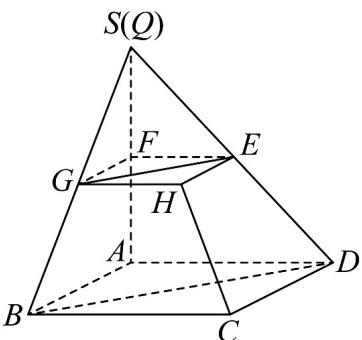

> [!faq]- 《专题15_空间点_直线_平面之间的位置关系_高效培优期中专项训练_数学》官方解析
>
> > [!success]- **【答案】** (1)证明见解析 (2)证明见解析
>
> > [!note]- **【解析】**
> > （1）
> >
> > 
> >
> > 如图，取 $AB, AD$ 的中点分别为 $S, T$ ，连接 $GS, ET, ST$ ，则 $ST // BD$ ，
> >
> > 因为四边形 $ABCD$ 和四边形 $EFGH$ 均为正方形， $AB = 2FG$ ，且 $AB // FG$ ， $AD // EF$
> >
> > 所以四边形 $FGSA, FETA$ 均为平行四边形，即 $GS // FA // ET$ ， $GS = FA = ET$
> >
> > 所以四边形 GETS 为平行四边形，所以 GE // TS，所以 GE // BD
> >
> > 所以 $B, D, E, G$ 四点共面·
> >
> > (2)
> >
> > 
> >
> > 延长 AF, BG ，设它们交于一点 S ，
> >
> > 因为 $AB \parallel FG$ ，且 $AB = 2FG$
> >
> > 所以 $\triangle SFG\sim \triangle SAB$ ，则 $\frac{SF}{SA} = \frac{FG}{AB} = \frac{1}{2}$
> >
> > 同理，延长 $AF, DE$ ，设它们交于一点 $Q$ ，
> >
> > 因为四边形 ABCD 和四边形 EFGH 均为正方形，AB = 2FG
> >
> > 则 $AD = 2EF$ ，又 $AD / / EF$
> >
> > 所以 $\triangle QEF\sim \triangle QAD$ ，则 $\frac{QF}{QA} = \frac{EF}{AD} = \frac{1}{2}$
> >
> > 因此 S 和 Q 是同一个点，
> >
> > 所以 AF, BG, DE 三条直线交于一点.
