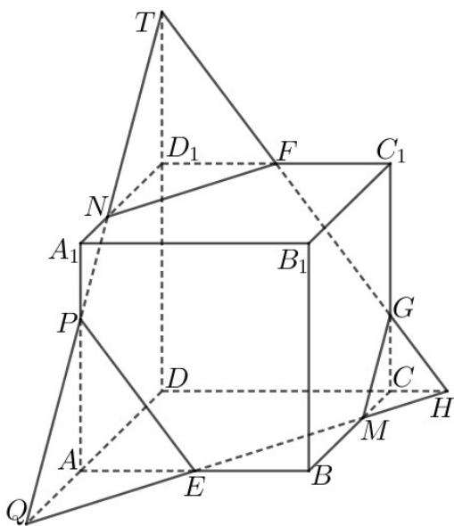
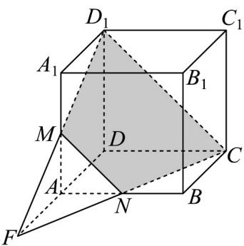

> [!faq]- 《专题15_空间点_直线_平面之间的位置关系_高效培优期中专项训练_数学》官方解析
>
> > [!success]- **【答案】** $10 + 2\sqrt{2}$
>
> > [!note]- **【解析】**
> > 如图，画直线 FG 交 $DC, DD_{1}$ 的延长线分别于点 H, T，连接 EH 交 BC 于点 M，交 DA 延长线于点 Q，连接 TQ 交 $D_{1}A_{1}, AA_{1}$ 分别于点 N, P，连接 GM, FN, EP，则六边形 EMGFNP 即为过点 E，F，G 的截面，由 G 为棱 $CC_{1}$ 上靠近点 C 的三等分点，得 $\frac{CH}{FC_{1}} = \frac{1}{2}$ ，即 $CH = \frac{3}{4}$ ，由 $\frac{CH}{BE} = \frac{1}{2}$ ，得点 M 为 BC 上靠近点 C 的三等分点，即 CM = 1，由 $\frac{CG}{DT} = \frac{CH}{DH} = \frac{1}{5}$ ，得 DT = 5, $D_{1}T = 2$ ， $\frac{D_{1}N}{DQ} = \frac{D_{1}T}{DT} = \frac{2}{5}$ ，由 $\frac{AQ}{BM} = \frac{AE}{EB} = 1$ ，得 AQ = BM = 2，即 $DQ = 5, D_{1}N = 2, A_{1}N = 1$ ，由 $\frac{A_{1}P}{AP} = \frac{A_{1}N}{AQ} = \frac{1}{2}$ ，得 $A_{1}P = 1, AP = 2$ ，由勾股定理得 $GM = \sqrt{2} = NP$ ， $FG = PE = \sqrt{4 + \frac{9}{4}} = \frac{5}{2}$ ，同理得 $EM = FN = \frac{5}{2}$ ，所以截面图形的周长为 $2\sqrt{2} + \frac{5}{2} \times 4 = 10 + 2\sqrt{2}$ 。故答案为： $10 + 2\sqrt{2}$ 。
> >
> > 
> >
> > 27. 正方体 $ABCD - A_1B_1C_1D_1$ 的棱长为 $x$ ，点 $M$ 是棱 $AA_1$ 的中点，过 $C, D_1, M$ 三点作正方体的截面，则该截面的面积为 \_\_\_\_.
> >
> > 【答案】 $\frac{9}{8} x^2$
> >
> > 【详解】取 AB 中点 N，延长 $D_{1}M, CN$ 交于点 F，
> >
> > 如图，四边形 $MNCD_{1}$ 的面积即为所求，是一个等腰梯形，由几何关系可得 $MN$ 为 $\Delta FCD_{1}$ 的中位线，
> >
> > 
> >
> > 则 $D_{1}C=\sqrt{2}x$ ， $CN=\sqrt{x^{2}+\left(\frac{1}{2}x\right)^{2}}=\frac{\sqrt{5}}{2}x$ ， $MN=\frac{1}{2}A_{1}B=\frac{\sqrt{2}}{2}x$ ，
> >
> > 设梯形的高为 $h$ ，则 $h = \sqrt{CN^2 - \left(\frac{1}{4} D_1C\right)^2} = \frac{3\sqrt{2}}{4} x$
> >
> > 所以 $S=\frac{\left(\sqrt{2}x+\frac{\sqrt{2}}{2}x\right)}{2}\times\frac{3\sqrt{2}x}{4}=\frac{9}{8}x^{2}$
> >
> > 故答案为： $\frac{9}{8}x^{2}$
