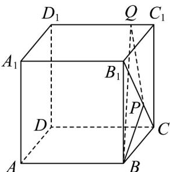
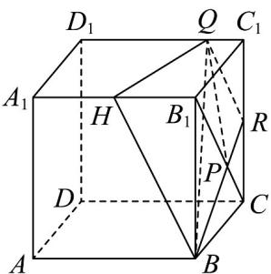
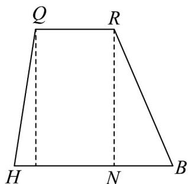

> [!faq]- 《专题15_空间点_直线_平面之间的位置关系_高效培优期中专项训练_数学》官方解析
>
> > [!success]- **【答案】**  A. $3\sqrt{5}$ B. $15\sqrt{3}$ C. $15\sqrt{15}$ D. $3\sqrt{21}$
>
> > [!note]- **【解析】**
> > 延长 $_{BP}$ 交 $CC_{1}$ 于点 $_{R}$ ，则 $\frac{CR}{B_{1}B}=\frac{CP}{B_{1}P}=\frac{1}{2}$ ，
> >
> > 即 R 为 $CC_{1}$ 的中点，
> >
> > 连接QR，取 $A_{1}B_{1}$ 中点H，连接BH，则 $BH//QR$ ，
> >
> > 
> >
> > 所以 B，H，Q，R 四点共面，故梯形 QRBH 即为截面图形，
> >
> > $$
> > B H = B R = 2 Q R = 2 \sqrt {5} \quad Q H = \sqrt {1 7}
> > $$
> >
> > $$
> > R H = \sqrt {B _ {1} H ^ {2} + B _ {1} R ^ {2}} = \sqrt {B _ {1} H ^ {2} + B _ {1} C _ {1} ^ {2} + C _ {1} R ^ {2}} = 2 \sqrt {6}
> > $$
> >
> > 记 $BH$ 边上的高为 $h$ ， $BN = x$
> >
> > 
> >
> > 则 $RB^{2} - BN^{2} = QH^{2} - (BH - QR - BN)^{2} = h^{2}\Rightarrow \left(2\sqrt{5}\right)^{2} - x^{2} = \left(\sqrt{17}\right)^{2} - \left(2\sqrt{5} -\sqrt{5} -x\right)^{2} = h^{2}$ 解得
> >
> > $$
> > x = \frac {4}{\sqrt {5}}, h = \frac {2 \sqrt {2 1}}{\sqrt {5}}
> > $$
> >
> > 所以 $S_{梯形BHQR}=\frac{1}{2}(QR+BH)h=\frac{1}{2}\times3\sqrt{5}\times\frac{2\sqrt{21}}{\sqrt{5}}=3\sqrt{21}$
> >
> > 故选 **D**.
