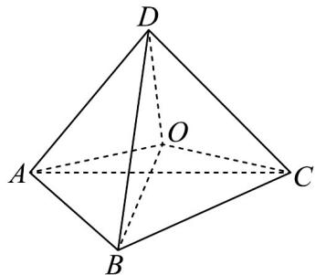
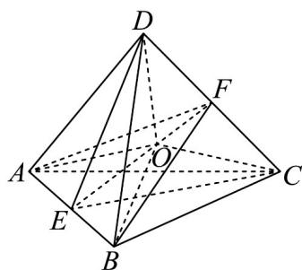

> [!faq]- 《专题15_空间点_直线_平面之间的位置关系_高效培优期中专项训练_数学》官方解析
>
> > [!success]- **【答案】** 
>
> > [!note]- **【解析】**
> > 如图所示，分别取 AB，CD 的中点 E，F，连结 E，F，
> >
> > 则由正四面体的性质，EF 过正四面体的中心 O，所以平面 OAB 即平面 FAB，平面 OCD 即平面 ECD，
> > 又因为 $EF \subset$ 平面 FAB ， $EF \subset$ 平面 ECD ，
> >
> > 所以平面 OAB 和平面 OCD 位于正四面体内部的交线为线段 EF，
> >
> > 又因为正四面体 $ABCD$ 的棱长为 $1$ ，则由勾股定理可得 $FA = FB = \sqrt{1^2 - \left(\frac{1}{2}\right)^2} = \frac{\sqrt{3}}{2}$ 。
> >
> > 所以在等腰三角形 $_{FAB}$ 中， $\left|EF\right|=\sqrt{\left|FA\right|^{2}-\left|EA\right|^{2}}=\sqrt{\left(\frac{\sqrt{3}}{2}\right)^{2}-\left(\frac{1}{2}\right)^{2}}=\frac{\sqrt{2}}{2}$
> >
> > 故答案为： $\frac{\sqrt{2}}{2}$
> >
> > 
