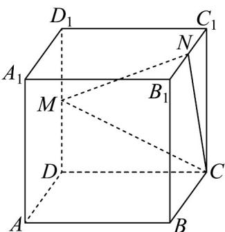
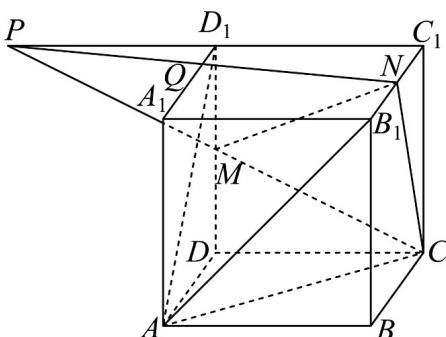

> [!faq]- 《专题15_空间点_直线_平面之间的位置关系_高效培优期中专项训练_数学》官方解析
>
> > [!success]- **【答案】**  A. 2 B. $\frac{3}{2}$ C. 1 D. $\frac{1}{2}$
>
> > [!note]- **【解析】**
> > 在平面 $CDD_{1}C_{1}$ 中，延长 CM 交 $C_{1}D_{1}$ 于 P，连接 PN，交 $A_{1}D_{1}$ 于 Q
> >
> > 在 $\triangle PCC_{1}$ 中， $D_{1}M // CC_{1}, D_{1}M = \frac{1}{2} CC_{1}$ ，则 $D_{1}P = C_{1}D_{1}$ ，
> >
> > 又在 $\triangle PC_{1}N$ 中， $D_{1}Q//NC_{1}, D_{1}P = C_{1}D_{1}$
> >
> > 则 $D_{1}Q = \frac{1}{2} NC_{1} = \frac{1}{4} B_{1}C_{1} = 1$
> >
> > 
> >
> > 故选 **C**
