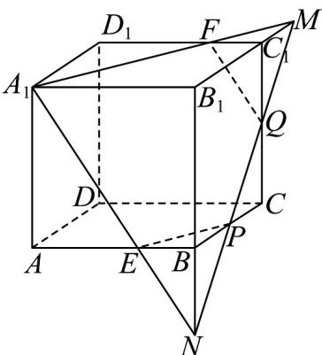

> [!faq]- 《专题15_空间点_直线_平面之间的位置关系_高效培优期中专项训练_数学》官方解析
>
> > [!success]- **【答案】** (1)9 (2) $3\sqrt{13}+\frac{3\sqrt{2}}{2}$
>
> > [!note]- **【解析】**
> > （1）由正方体特征知， $V_{A-BB_{1}D_{1}D}=2V_{A-BB_{1}D}=2V_{B_{1}-ABD}=V_{B_{1}-ABCD}=\frac{1}{3}V_{ABCD-A_{1}B_{1}D_{1}D_{1}}=\frac{1}{3}\times3^{3}=9$
> >
> > (2) 如图，延长 $PQ$ 交 $B_{1}C_{1}$ 于点 $M$ ，延长 $QP$ 交 $B_{1}B$ 于点 $N$ ，连接 $A_{1}M$ 交 $C_{1}D_{1}$ 于点 $F$ ，连接 $A_{1}N$ 交 $AB$ 于点 $E$ ，连接 $FQ$ ， $EP$ 。则过点 $A_{1}P$ ， $Q$ 的平面截正方体所得的截面为五边形 $A_{1}EPQF$ 。
> >
> > 
> >
> > 因为 P 为 BC 的中点，Q 为 $CC_{1}$ 的中点，
> >
> > 所以 $C_{1}M=\frac{1}{2}B_{1}C_{1}=\frac{3}{2}$ ， $BN=\frac{1}{2}B_{1}B=\frac{3}{2}$ ，
> >
> > 所以 $C_{1}F=\frac{1}{3}A_{1}D_{1}=1$ ， $BE=\frac{1}{3}A_{1}B_{1}=1$ ，
> >
> > 所以 $A_{1}E = A_{1}F = \sqrt{A_{1}A^{2} + AE^{2}} = \sqrt{3^{2} + 2^{2}} = \sqrt{13}$
> >
> > $$
> > \frac {B P}{B _ {1} M} = \frac {N B}{N B _ {1}} \Rightarrow B P = \frac {N B \cdot B _ {1} M}{N B _ {1}} = \frac {\frac {3}{2} \times \frac {9}{2}}{\frac {9}{2}} = \frac {3}{2}
> > $$
> >
> > $$
> > E P = F Q = \sqrt {E B ^ {2} + B P ^ {2}} = \sqrt {1 ^ {2} + \left(\frac {3}{2}\right) ^ {2}} = \frac {\sqrt {1 3}}{2}
> > $$
> >
> > $PQ = \sqrt{2} CP = \frac{3\sqrt{2}}{2}$
> >
> > 即截面周长为 $EP + PQ + FQ + A_{1}F + A_{1}E = \frac{\sqrt{13}}{2} + \frac{3\sqrt{2}}{2} + \frac{\sqrt{13}}{2} + \sqrt{13} + \sqrt{13} = 3\sqrt{13} + \frac{3\sqrt{2}}{2}$
