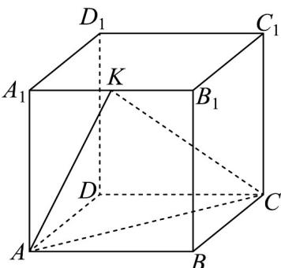
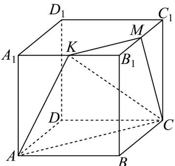
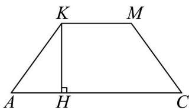

> [!faq]- 《专题15_空间点_直线_平面之间的位置关系_高效培优期中专项训练_数学》官方解析
>
> > [!success]- **【答案】** 
>
> > [!note]- **【解析】**
> > 如图，取 $B_{1}C_{1}$ 的中点 $M$ ，连接 $KM, MC$ ，易证四边形 $KMCA$ 为等腰梯形，上底 $KM = \frac{\sqrt{2}}{2}$ ，下底 $AC = \sqrt{2}$ ，腰长 $AK = MC = \frac{\sqrt{5}}{2}$ ，则其高为 $KH = \frac{3\sqrt{2}}{4}$ ，所以计算可得其面积为 $\frac{9}{8}$ .
> >
> > 
> >
> > 
