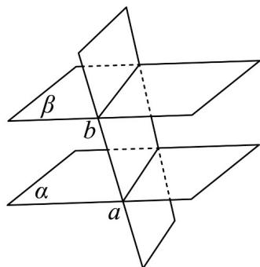
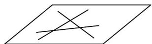
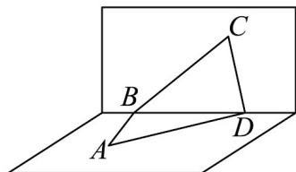
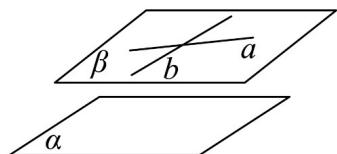

> [!faq]- 《专题15_空间点_直线_平面之间的位置关系_高效培优期中专项训练_数学》官方解析
>
> > [!success]- **【答案】** A．若 a、b 是两条直线， $\alpha$ 、 $\beta$ 是两个平面，且 $a \subset \alpha$ ， $b \subset \beta$ ，则 a、b 是异面直线 B．两两相交且不共点的三条直线确定一个平面 C．四边形可以确定一个平面 D．已知两条相交直线 a、b，且 $a \parallel$ 平面 $\alpha$ ，则 b 与 $\alpha$ 的位置关系是相交
>
> > [!note]- **【解析】**
> > 
> >
> > 如图所示，当 $\alpha//\beta$ ，被第三个面所截，截得交线为 a, b，此时 $a \subset \alpha$ ， $b \subset \beta$ ，不满足 a、b 是异面直线，所以 A 错误.
> >
> > 
> >
> > 如图所示，三条直线两两相交不公点，形成不在一条直线上的三个点，这三个点确定一个平面，这三条线每条线有两个点在面上，则这三条线也在面上，所以两两相交且不共点的三条直线确定一个平面，所以 $^{B}$ 正确·
> >
> > 
> >
> > 如图所示，四边形有四个顶点，当第四个点不在前面三个点形成的平面上时，四边形不能确定一个面，所以 $C$ 错误.
> >
> > 
> >
> > 如图所示，当两条相交直线 a、b 形成的平面 $\beta$ 平行平面 $\alpha$ 时，有 $a \parallel$ 平面 $\alpha$ ， $b \parallel$ 平面 $\alpha$ ，所以 D 错误。
> >
> > 故选 **B**.
