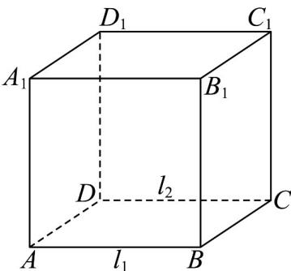

> [!faq]- 《专题15_空间点_直线_平面之间的位置关系_高效培优期中专项训练_数学》官方解析
>
> > [!success]- **【答案】** A. $l_{2} // \alpha$ B. $l_{2} \perp \alpha$ C. $l_{2} // \alpha$ 或 $l_{2} \subset \alpha$ D. $l_{2}$ 与 $\alpha$ 相交
>
> > [!note]- **【解析】**
> > 
> >
> > 在正方体 $ABCD - A_{1}B_{1}C_{1}D_{1}$ 中，取 $AB = l_{1}$ ， $CD = l_{2}$ ，
> > 当取面 $CDD_{1}C_{1}$ 为平面 $\alpha$ 时，
> > 所以满足 $l_{1}//l_{2}$ ， $l_{1}//\alpha$ ，此时 $l_{2}\subset\alpha$ ；
> > 当取面 $B_{1}A_{1}D_{1}C_{1}$ 为平面 $\alpha$ 时，
> > 所以满足 $l_{1}//l_{2}$ ， $l_{1}//\alpha$ ，此时 $l_{2}//\alpha$ ，
> > 所以 $l_{2}$ 与平面 $\alpha$ 的关系是 $l_{2}/\alpha$ 或 $l_{2}\subset\alpha$ .
> >
> > 故选 **C**·
