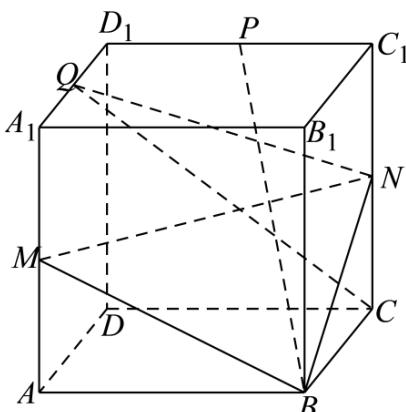
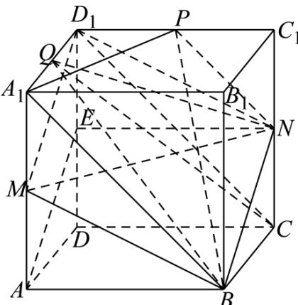

> [!faq]- 《专题15_空间点_直线_平面之间的位置关系_高效培优期中专项训练_数学》官方解析
>
> > [!success]- **【答案】**  A. 点 $D_{1}$ 在平面 $MBN$ 外 B. 直线 $CQ$ 在平面 $MBN$ 外 C．存在点Q，使B、N、P、Q四点共面 D．三棱锥 $B - CNQ$ 的体积为定值
>
> > [!note]- **【解析】**
> > 对于 $^{A}$ 选项，取 $DD_{1}$ 的中点E，连接AE、EN、 $D_{1}M$ 、 $D_{1}N$ ，
> >
> > 在正方体 $ABCD - A_{1}B_{1}C_{1}D_{1}$ 中， $AA_{1}//DD_{1}$ ， $AA_{1} = DD_{1}$ ，M、E 分别为 $AA_{1}$ 、 $DD_{1}$ 的中点，
> >
> > 所以， $AM \parallel D_{1}E$ 且 $AM = D_{1}E$ ，所以，四边形 $AMD_{1}E$ 为平行四边形，
> >
> > 所以， $AE//D_{1}M$ 且 $AE = D_{1}M$
> >
> > 同理可证四边形 CDEN 为平行四边形，则 EN // CD 且 EN = CD，
> >
> > 因为 $AB // CD$ 且 $AB = CD$ ，所以， $AB // EN$ 且 $AB = EN$
> >
> > 所以，四边形 $ABNE$ 为平行四边形，
> >
> > 所以， $BN \parallel AE$ 且 $BN = AE$ ，故 $BN \parallel D_{1}M$ 且 $BN = D_{1}M$ ，
> >
> > 所以，四边形 $BND_{1}M$ 为平行四边形，即 $D_{1} \in$ 平面 BMN ，A 错；
> >
> > 对于 B 选项，假设 $CQ \subset$ 平面 BMN，则 $C \in$ 平面 BMN，实际上 $C \notin$ 平面 BMN，假设不成立，
> >
> > 故直线 $CQ$ 在平面 $MBN$ 外， $^{\mathrm{B}}$ 对；
> >
> > 对于 C 选项，连接 PN、 $A_{1}P$ 、AB、 $CD_{1}$ ，
> >
> > 因为 $A_{1}D_{1} / / BC$ 且 $A_{1}D_{1} = BC$ ，所以，四边形 $A_{1}BCD_{1}$ 为平行四边形，则 $A_{1}B / / CD_{1}$
> >
> > 因为 $P$ 、 $N$ 分别为 $C_1D_1$ 、 $CC_{1}$ 的中点，则 $PN//CD_{1}$ ，所以， $PN//A_{1}B$
> >
> > 所以，B、N、P、 $A_{1}$ 四点共面，故当点Q与 $A_{1}$ 重合时，B、N、P、Q四点共面，C对；
> >
> > 对于 D 选项，因为 $A_{1}D_{1}//BC$ ， $A_{1}D_{1}\not\subset$ 平面 BCN， $BC\subset$ 平面 BCN， $\therefore A_{1}D_{1}//$ 平面 BCN，
> >
> > ∵ $Q \in A_{1}D_{1}$ ，故点 Q 到平面 BCN 的距离为定值，
> >
> > 又因为 $\triangle BCN$ 的面积也为定值，故 $V_{B - CNQ} = V_{Q - BCN}$ 为定值，D对
> >
> > 故选：BCD.
> >
> > 
