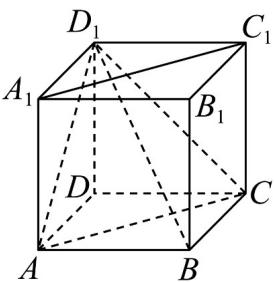

> [!faq]- 《专题15_空间点_直线_平面之间的位置关系_高效培优期中专项训练_数学》官方解析
>
> > [!success]- **【答案】**  A. 直线 $A_{1}C_{1}$ 与 $BD_{1}$ 为异面直线 B. 直线 $BB_{1}$ 与平面 $ACD_{1}$ 平行 C. 将形状为正方体 $ABCD - A_{1}B_{1}C_{1}D_{1}$ 的铁块磨制成一个球体零件，可能制作的最大零件的表面积为 $16\pi$ D. 若矩形 $ACC_{1}A_{1}$ 是某圆柱的轴截面（过圆柱的轴的截面叫做圆柱的轴截面），则从 $A$ 点出发沿该圆柱的侧面到相对顶点 $C_{1}$ 的最短距离是 $\sqrt{4 + 2\pi^{2}}$
>
> > [!note]- **【解析】**
> > 对于 A，直线 $A_{1}C_{1}$ 与 $BD_{1}$ 既不平行也不相交，是异面直线，A 正确；
> >
> > 对于 B， $BB_{1}//DD_{1}$ ，而直线 $DD_{1}$ 与平面 $ACD_{1}$ 相交，故直线 $BB_{1}$ 与平面 $ACD_{1}$ 也相交，B 错误；
> >
> > 对于 $C$ ，将形状为正方体 $ABCD - A_1B_1C_1D_1$ 的铁块磨制成一个球体零件，当球的半径为棱长一半，即其半径为 $1$ 时，球的表面积最大，其表面积最大值 $S = 4\pi \times 1^2 = 4\pi$ ， $C$ 错误；
> >
> > 对于 $^{D}$ ，从 A 点沿圆柱的侧面到相对顶点 $C_{1}$ 的最短距离即为圆柱侧面展开图一个顶点到对边中点的距离，即其最短距离 $d = \sqrt{4 + 2\pi^{2}}$ 或 $\sqrt{8 + \pi^{2}}$ ， $^{D}$ 错误；
> >
> > 故选：BCD。
> >
> > <!-- source-part:2 pages:51-54 -->
> >
> > ## 考点09空间中平面与平面的位置关系
