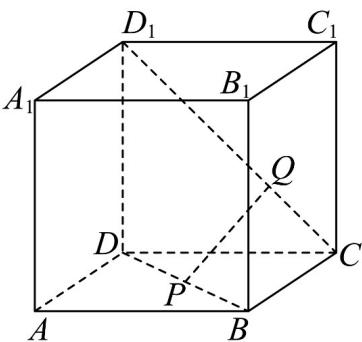

<!-- question-source:start -->
13. 如图，已知在正方体 $ABCD - A_{1}B_{1}C_{1}D_{1}$ 中， $P$ ， $Q$ 分别为对角线 $BD$ ， $CD_{1}$ 上的点，

$$
\frac {C Q}{Q D _ {1}} = \frac {B P}{P D} = \lambda (0 <   \lambda <   1)
$$

(1)求证： $PQ \parallel$ 平面 $BCC_{1}B_{1}$ .

(2)若 R 是 AB 上的点，当 $\frac{AR}{AB}$ 的值为多少时（用 $\lambda$ 表示），能使平面 $PQR \parallel$ 平面 $A_{1}D_{1}DA$ ? 请给出证明.
<!-- question-source:end -->

![[高中/课堂同步/题库/人教A版高中数学同步讲义(2026)/02_必修第二册/期中专项训练+期中模拟卷/专项训练/专题17_空间直线_平面的平行_面面平行_高效培优期中专项训练_数学人/_compact/answers/Q00064213A1.md]]
