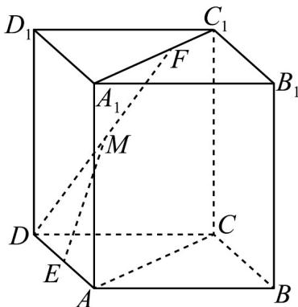

<!-- question-source:start -->
17. 如图，四棱柱 $ABCD - A_{1}B_{1}C_{1}D_{1}$ 中， $F$ 是线段 $A_{1}C_{1}$ 上异于点 $A_{1}$ 的一个动点， $E$ ， $M$ 分别是 $AD$ ， $DF$ 的中点。

(1) 求证： $EM \parallel$ 平面 $ACC_{1}A_{1}$ ;

(2) 在棱 $A_{1}D_{1}$ 上是否存在一点 $N$ ，使得平面 $NEM//$ 平面 $ACC_{1}A_{1}$ ？若存在，求出 $\frac{D_{1}N}{NA_{1}}$ 的值；若不存在，请说明理由·
<!-- question-source:end -->

![[高中/课堂同步/题库/人教A版高中数学同步讲义(2026)/02_必修第二册/期中专项训练+期中模拟卷/专项训练/专题17_空间直线_平面的平行_面面平行_高效培优期中专项训练_数学人/_compact/answers/Q00064216A1.md]]
