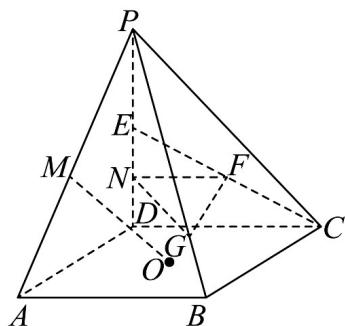

<!-- question-source:start -->
21. 在四棱锥 $P - ABCD$ 中，底面 $ABCD$ 为平行四边形， $O$ 为底面中心， $M, E$ 分别为 $PA, PD$ 的中点， $\triangle PDC$ 为等腰直角三角形，且 $\left|DP\right| = \left|DC\right|$ .

(1)若平面 $PBC \cap$ 平面 $PAD = l$ ，判断直线 $l$ 与 $BC$ 的位置关系并证明；

(2)求异面直线 $MO$ 与 $EC$ 所成角的余弦值；

(3)若 $F,N$ 分为 $CE,DE$ 的中点，点 $G$ 在线段 $PB$ 上，且 $|PG| = \lambda |GB|$ ，若平面 $GFN//$ 平面 $ABCD$ ，求实数 $\lambda$ 的值·
<!-- question-source:end -->

![[高中/课堂同步/题库/人教A版高中数学同步讲义(2026)/02_必修第二册/期中专项训练+期中模拟卷/专项训练/专题17_空间直线_平面的平行_面面平行_高效培优期中专项训练_数学人/_compact/answers/Q00064219A1.md]]
