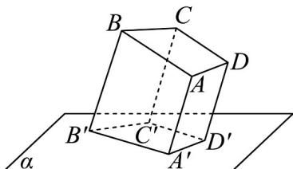

<!-- question-source:start -->
24. 如图，梯形 $ABCD$ 中 $AB \parallel CD$ ，四边形 $A'B'C'D'$ 是梯形 $ABCD$ 在平面 $\alpha$ 内的投影（

$AA' //BB' //CC' //DD'$ ，则对四边形 $A'B'C'D'$ 的判断正确的是（）

A. 可能是平行四边形不可能是梯形 B. 可能是任意四边形 C. 可能是平行四边形也可能是梯形 D. 只可能是梯形
<!-- question-source:end -->

![[高中/课堂同步/题库/人教A版高中数学同步讲义(2026)/02_必修第二册/期中专项训练+期中模拟卷/专项训练/专题17_空间直线_平面的平行_面面平行_高效培优期中专项训练_数学人/_compact/answers/Q00064222A1.md]]
