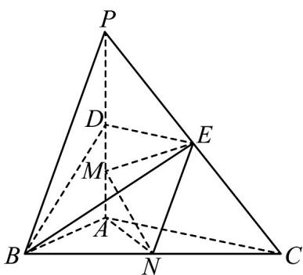

<!-- question-source:start -->
28. 如图，在三棱锥 $P - ABC$ 中， $PA \perp$ 底面 $ABC$ ， $\angle BAC = 90^\circ$ ·点 $D$ 、 $E$ 、 $N$ 分别为棱 $PA$ 、 $PC$ 、 $BC$ 的中点， $M$ 是线段 $AD$ 的中点， $PA = AC = 2$ ， $AB = 1$ .

(1)求证： $MN / /$ 平面 $BDE$ ；

(2)求点 $N$ 到直线 $ME$ 的距离；
<!-- question-source:end -->

![[高中/课堂同步/题库/人教A版高中数学同步讲义(2026)/02_必修第二册/期中专项训练+期中模拟卷/专项训练/专题17_空间直线_平面的平行_面面平行_高效培优期中专项训练_数学人/_compact/answers/Q00064225A1.md]]
