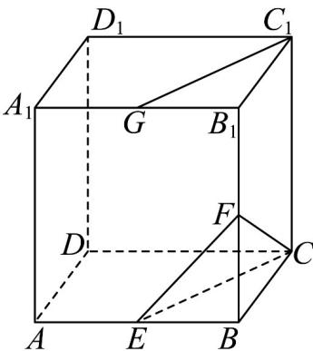

<!-- question-source:start -->
31. 如图，在长方体 $ABCD - A_1B_1C_1D_1$ 中， $E, F, G$ 分别是棱 $AB, BB_1, A_1B_1$ 的中点.

(1)证明： $C_{1}G//$ 平面CEF.

(2)在棱 $AA_{1}$ 上是否存在点 $_{H}$ ，使得平面 $C_{1}GH //$ 平面 $CEF$ ？若存在，求出 $\frac{A_{1}H}{A_{1}A}$ 的值；若不存在，请说明理由·
<!-- question-source:end -->

![[高中/课堂同步/题库/人教A版高中数学同步讲义(2026)/02_必修第二册/期中专项训练+期中模拟卷/专项训练/专题17_空间直线_平面的平行_面面平行_高效培优期中专项训练_数学人/_compact/answers/Q00064228A1.md]]
