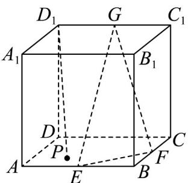

<!-- question-source:start -->
36. 在长方体 $ABCD - A_1B_1C_1D_1$ 中， $AD = DD_1 = 1$ ， $AB = \sqrt{3}$ ， $E$ 、 $F$ 、 $G$ 分别为 $AB$ 、 $BC$ 、 $C_1D_1$ 的中点。

(1)求三棱锥 A-GEF 的体积；

(2) 点 $P$ 在矩形 $ABCD$ 内，若直线 $D_{1}P//$ 平面 $EFG$ ，求线段 $D_{1}P$ 长度的最小值.
<!-- question-source:end -->

![[高中/课堂同步/题库/人教A版高中数学同步讲义(2026)/02_必修第二册/期中专项训练+期中模拟卷/专项训练/专题17_空间直线_平面的平行_面面平行_高效培优期中专项训练_数学人/_compact/answers/Q00064232A1.md]]
