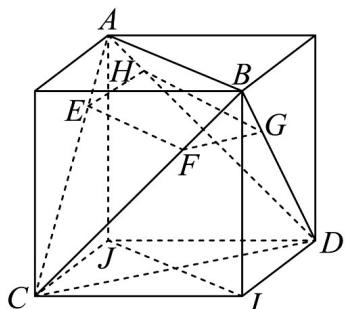

> [!faq]- 《专题17_空间直线_平面的平行_面面平行_高效培优期中专项训练_数学人》官方解析
>
> > [!success]- **【答案】** A
>
> > [!note]- **【解析】**
> > 将正四面体补形成正方体，如图，
> > 因为 $AB \parallel \alpha$ ， $IJ \parallel AB$ ，所以 $IJ \parallel \alpha$ ，
> > 又 CD//α, CD, IJ 是平面 CIDJ 内的相交直线，所以平面 CIDJ// 平面 α 因为 AB、CD 到平面 α 的距离分别是 $^{3}$ 和 $^{9}$ ，所以正方体棱长为 12，
> > 结合正方体对称性可知，球心 O 到平面 $\alpha$ 的距离为 $^{3}$ 记正四面体的外接球的半径为 R，则 $4R^{2}=3\times12^{2}$ ，解得 $R=6\sqrt{3}$ ，
> > 则外接球被平面 $\alpha$ 截得的截面半径 $r=\sqrt{R^{2}-3^{2}}=3\sqrt{11}$ 所以，截面面积为 $\pi r^{2}=99\pi$
> >
> > 故选：A
> >
> > 
