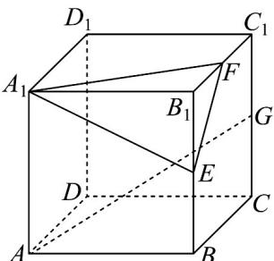
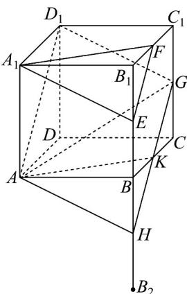
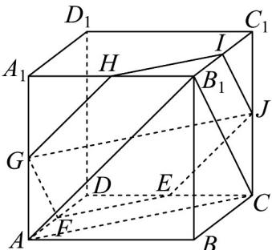

> [!faq]- 《专题17_空间直线_平面的平行_面面平行_高效培优期中专项训练_数学人》官方解析
>
> > [!success]- **【答案】**  A. 截面图形是梯形 B．截面图形是五边形 C. 截面的面积为 $\frac{9}{2}$ D．该截面所在平面截正方体 $ABCD - A_{1}B_{1}C_{1}D_{1}$ 的外接球所得截面的面积为 $\frac{26\pi}{9}$
>
> > [!note]- **【解析】**
> > 
> >
> > 延长 $B_{1}B$ 至点 $B_{2}$ 使得 $B_{1}B = BB_{2}$ ，取 $BB_{2}, BC$ 的中点 $H, K$ ，连接 $AH, AD_{1}, GD_{1}, GH, AK$
> >
> > 因为点 E, F 分别是棱 $B_{1}B$ ， $B_{1}C_{1}$ 的中点，点 G 是棱 $C_{1}C$ 的中点，
> >
> > 所以 $EF\| BC_1\| GK\| AD_1$ ，在正方体中， $A_{1}F\| AK$
> >
> > 因为 $EF \notin$ 平面 $AKGD_{1}$ ， $GK \subset$ 平面 $AKGD_{1}$ ，所以 $EF \parallel$ 平面 $AKGD_{1}$
> >
> > 同理 $A_{1}E$ // 平面 $AKGD_{1}$
> >
> > 又 $EF \cap A_{1}E = E$ 且 $EF A_{1}E \subset$ 平面 $A_{1}EF$ ，所以平面 $A_{1}EF$ // 平面 $AKGD_{1}$
> >
> > 则过线段 AG 作与平面 $A_{1}EF$ 平行的平面为梯形 $AKGD_{1}$ .
> >
> > 对于 AB，A 正确，B 错误；
> >
> > 对于 $C$ ，正方体的棱长为 $2$ ，所以 $AK = D_{1}G = \sqrt{AB^{2} + BK^{2}} = \sqrt{2^{2} + 1^{2}} = \sqrt{5}$
> >
> > $$
> > A D _ {1} = \sqrt {A A _ {1} ^ {2} + A _ {1} D _ {1} ^ {2}} = \sqrt {2 ^ {2} + 2 ^ {2}} = 2 \sqrt {2}, G K = \frac {1}{2} A D _ {1} = \sqrt {2}
> > $$
> >
> > 计算等腰梯形的高为 $h=\sqrt{5-\frac{1}{2}}=\frac{3\sqrt{2}}{2}$
> >
> > 则截面梯形 $AKGD_{1}$ 面积为 $S=\frac{1}{2}(2\sqrt{2}+\sqrt{2})\times\frac{3\sqrt{2}}{2}=\frac{9}{2}$ ，C 正确；
> >
> > 对于 D，正方体 $ABCD - A_{1}B_{1}C_{1}D_{1}$ 的外接球球心在正方体体对角线 $AC_{1}$ 的中点，
> >
> > 所以球的半径 $R = \frac{1}{2} \times \sqrt{2^2 + 2^2 + 2^2} = \sqrt{3}$
> >
> > 在正方体中，设点 $C_1$ 到平面 $AKG$ 的距离为 $2d$ ，则球心到平面 $AKG$ 的距离为 $d$
> >
> > 在 $\triangle AKG$ 中， $AK = \sqrt{5}, AG = 3, KG = \sqrt{2}$ ， $\cos \angle AKG = \frac{5 + 2 - 9}{2 \times \sqrt{5} \times \sqrt{2}} = -\frac{\sqrt{10}}{10}$ ，
> >
> > 所以 $\sin\angle AKG=\frac{3\sqrt{10}}{10}$ ，则 $\triangle AKG$ 面积为 $\frac{1}{2}\times\sqrt{2}\times\sqrt{5}\times\frac{3\sqrt{10}}{10}=\frac{3}{2}$
> >
> > 根据等体积 $V_{C_{1}-AKG}=V_{A-C_{1}KG},\therefore\frac{1}{3}\times\frac{1}{2}\times1\times1\times2=\frac{1}{3}\times\frac{3}{2}\times2d$ ，解得 $d=\frac{1}{3}$
> >
> > 因此该截面所在平面截正方体 $ABCD-A_{1}B_{1}C_{1}D_{1}$ 的外接球所得截面圆的半径 $r=\sqrt{R^{2}-d^{2}}=\sqrt{3-\left(\frac{1}{3}\right)^{2}}=\frac{\sqrt{26}}{3}$ ，
> > 所以面积为 $\pi r^{2}=\frac{26\pi}{9}$ ，D 正确；
> >
> > 故选：ACD.
> >
> > 8. 棱长为 $^{2}$ 的正方体 $ABCD-A_{1}B_{1}C_{1}D_{1}$ 中，E 为棱 CD 的中点，过点 E 作平面 $\alpha$ ，使得平面 $\alpha //$ 平面 $AB_{1}C$ ，则平面 $\alpha$ 在正方体表面上截得的图形的周长为 \_\_\_\_.
> >
> > 【答案】 $6 \sqrt{2}$
> >
> > 【详解】如图，点 $F$ ， $G$ ， $H$ ， $I$ ， $J$ 分别为棱 $AD$ ， $AA_{1}$ ， $A_{1}B_{1}$ ， $B_{1}C_{1}$ ， $CC_{1}$ 的中点，
> >
> > 连接 EF，FG，GH，HI，IJ，JE，GJ。
> >
> > 
> >
> > 由正方体及三角形中位线性质可得： $HI //GJ //FE //AC$ ， $GH //EJ //AB_{1}$ ， $FG //B_{1}C //IJ$ 。
> >
> > 因为 $FE // AC$ ， $AC \subset$ 平面 $AB_{1}C$ ， $EF \notin$ 平面 $AB_{1}C$
> >
> > 所以 EF // 平面 $AB_{1}C$
> >
> > 因为 $EJ \parallel AB_{1}$ ， $AB_{1} \subset$ 平面 $AB_{1}C$ ， $EJ \not\subset$ 平面 $AB_{1}C$ ，
> >
> > 所以 $EJ \parallel$ 平面 $AB_{1}C$
> >
> > 又因为 $EJ \cap EF = E$ ， $EJ \subset$ 平面 EJF， $EF \subset$ 平面 EJF，
> >
> > 所以平面 $EJF / /$ 平面 $AB_{1}C$
> >
> > 则平面 EJF 即为平面 $\alpha$ .
> >
> > 由 $EF // GJ$ 可得： $G, J, E, F$ 四点共面 $\alpha$ .
> >
> > 又因为 $GH \parallel EJ$ ， $G \in$ 平面 $\alpha$
> >
> > 所以 $H \in$ 平面 $\alpha$ ，
> >
> > 同理可得： $I \in$ 平面 $\alpha$ ，即平面 EFGHIJ 即为平面 $\alpha$ .
> >
> > 由三角形中位线性质可得：该六边形 $EFGHIJ$ 每条边的长度等于正方体面对角线的一半，即每条边长度为 $\frac{\sqrt{2^2 + 2^2}}{2} = \sqrt{2}$ ，
> >
> > 故平面 $\alpha$ 在正方体表面上截得的图形的周长为 $6\sqrt{2}$
> >
> > 故答案为： $6\sqrt{2}$
