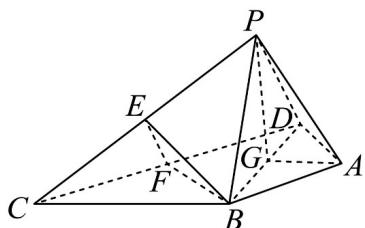
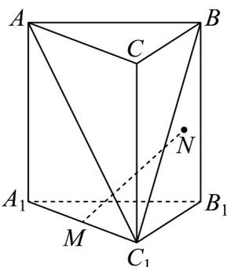
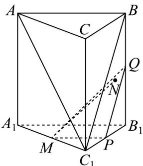

> [!faq]- 《专题17_空间直线_平面的平行_面面平行_高效培优期中专项训练_数学人》官方解析
>
> > [!success]- **【答案】** (1)证明见解析 (2) $-\frac{1}{2}$
>
> > [!note]- **【解析】**
> > （1）在 $\triangle PCD$ 中，点 $E, F$ 分别为 $PC, CD$ 的中点，
> >
> > 所以 $EF // PD$ ，因为 $PD \subset$ 平面 $PDA$ ，而 $EF$ 不在平面 $PDA$ 内，
> >
> > 所以 EF // 平面 PDA·
> >
> > 因为 $AB = AD, \angle BAD = 120^{\circ}$ ，所以 $\angle BDA = 30^{\circ}$ .
> >
> > 因为 $\triangle BCD$ 为等边三角形，所以 $\angle BDC = 60^{\circ}$
> >
> > 所以 $\angle ADC = 90^{\circ}$ · 又 $BF \perp CD$ ，所以 $BF // AD$ ·
> >
> > 又因为 $AD \subset$ 平面 PDA，而 BF 不在平面 PDA 内，
> >
> > 所以 BF // 平面 PDA·
> >
> > 又 $EF \cap BF = F, EF, BF \subset$ 平面 BEF
> >
> > 所以平面 BEF // 平面 PAD.
> >
> > (2) 取 BD 的中点为 G，连接 AG, PG.
> >
> > 因为 $AB = AD = PB = PD$ ，所以 $AG \perp BD, PG \perp BD$ .
> >
> > 因为 $AG \cap PG = G$ ，平面 $PBD \cap$ 平面 $ABD = BD$
> >
> > 所以二面角 $P - BD - A$ 的平面角为 $\angle PGA$ .
> >
> > 因为 $DG=\frac{1}{2}BD=\sqrt{3}$ ，所以 $AG=DG\times\frac{\sqrt{3}}{3}=1,AD=PD=\sqrt{1+3}=2$ .
> >
> > 所以 $PG = \sqrt{PD^{2} - DG^{2}} = 1$ .
> >
> > 根据余弦定理得 $\cos\angle PGA=\frac{PG^{2}+AG^{2}-PA^{2}}{2PG\times AG}=\frac{1+1-3}{2\times1\times1}=-\frac{1}{2}$
> >
> > 所以二面角 $P - BD - A$ 的余弦值为 $-\frac{1}{2}$
> >
> > 
> >
> > 11. 柱是建筑物中用来承托建筑物上部重量的直立的杆体，俗称“柱子”·柱子在各个时期既有延续与继承，又有发展和变化，如方柱在秦代时开始出现，而在汉代时则又增加了八角形柱、束竹式柱、人像柱等·某凉亭的一根正三棱形柱子可近似看作如图所示的图形，记该正三棱柱为 $ABC-A_{1}B_{1}C_{1}$ ，其底面边长是3，侧棱长是 $12\sqrt{5}$ ，M为 $A_{1}C_{1}$ 的中点，N是侧面 $BCC_{1}B_{1}$ 上一点，且 $MN \parallel$ 平面 $ABC_{1}$ ，则点N的轨迹长为（）
> >
> > 【答案】
> >
> > 
> >
> > A. 27 B. $\frac{27}{2}$ C. 12 D. 6
> >
> > 【答案】B
> >
> > 【详解】分别取 $C_{1}B_{1}$ ， $B_{1}B$ 的中点P，Q，连接MP，PQ。
> >
> > 因为 $MP / / A_{1}B_{1}$ ， $A_{1}B_{1} / / AB$
> >
> > 所以 $MP \parallel AB$ ， $MP \not\subset$ 平面 $ABC_{1}$ ， $AB \subset$ 平面 $ABC_{1}$ .
> >
> > 所以 $MP \parallel$ 平面 $ABC_{1}$ · 又 $PQ \parallel C_{1}B$ ， $PQ \not\subset$ 平面 $ABC_{1}$ ， $C_{1}B \subset$ 平面 $ABC_{1}$ .
> >
> > 所以 $PQ //$ 平面 $ABC_{1}$ ， $MP \cap PQ = P, MP, PQ \subset$ 平面 $MPQ$
> >
> > 所以平面 $MPQ / /$ 平面 $ABC_{1}$
> >
> > 所以当点 N 在线段 PQ 上运动时，有 $MN \parallel$ 平面 $ABC_{1}$ ，
> >
> > 所以点 $N$ 的轨迹长为 $\frac{1}{2} C_1B = \frac{1}{2}\times \sqrt{3^2 + (12\sqrt{5})^2} = \frac{27}{2}$ 故B正确·故选：B.
> >
> > 
