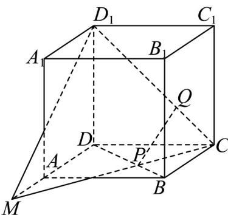
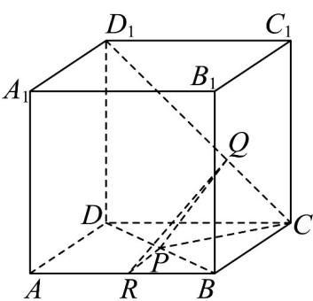

> [!faq]- 《专题17_空间直线_平面的平行_面面平行_高效培优期中专项训练_数学人》官方解析
>
> > [!success]- **【答案】** (1)证明见解析 (2) $\frac{AR}{AB}$ 的值为 $\frac{1}{1 + \lambda} (0 < \lambda < 1)$ ，证明见解析
>
> > [!note]- **【解析】**
> > （1）如图，连接 CP 并延长，与 DA 的延长线交于 M 点，则平面 PQC 和平面 $AA_{1}D_{1}D$ 的交线为 $D_{1}M$ .
> >
> > 
> >
> > 因为四边形 ABCD 为正方形，所以 $BC \parallel AD$ ，
> >
> > 故 $\triangle PBC\sim \triangle PDM$ ，所以 $\frac{CP}{PM} = \frac{BP}{PD} = \lambda (0 <   \lambda <  1)$
> >
> > 又因为 $\frac{CQ}{QD_1} = \frac{BP}{PD} = \lambda (0 < \lambda < 1)$ ，所以 $\frac{CQ}{QD_1} = \frac{CP}{PM} = \lambda$ ，所以 $PQ \parallel MD_1$ 因为 $MD_1 \subset$ 平面 $A_1D_1DA$ ， $PQ \not\subset$ 平面 $A_1D_1DA$ ，所以 $PQ \parallel$ 平面 $A_1D_1DA$ 。又平面 $BCC_1B_1 \parallel$ 平面 $A_1D_1DA$ ，故 $PQ \parallel$ 平面 $BCC_1B_1$ 。
> >
> > (2) 当 $\frac{AR}{AB}$ 的值为 $\frac{1}{1+\lambda}(0<\lambda<1)$ 时，能使平面 $PQR//$ 平面 $A_{1}D_{1}DA$ 证明：如图，因为 $\frac{AR}{AB} = \frac{1}{1 + \lambda}$ ，即 $\frac{BR}{RA} = \lambda (0 < \lambda < 1)$ ，
> >
> > 
> >
> > 又 $\frac{BR}{RA} = \frac{BP}{PD}$ ，所以 $PR / / DA$
> >
> > 因为 $DA \subset$ 平面 $A_{1}D_{1}DA$ ， $PR \subset$ 平面 $A_{1}D_{1}DA$ ，所以 $PR //$ 平面 $A_{1}D_{1}DA$
> >
> > 又 $PQ \cap PR = P$ ， $PQ // \text{平面 } A_{1}D_{1}DA$ ， $PQ, PR \subset \text{平面 } PQR$
> >
> > 所以平面 $PQR //$ 平面 $A_{1}D_{1}DA$ .
