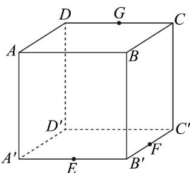
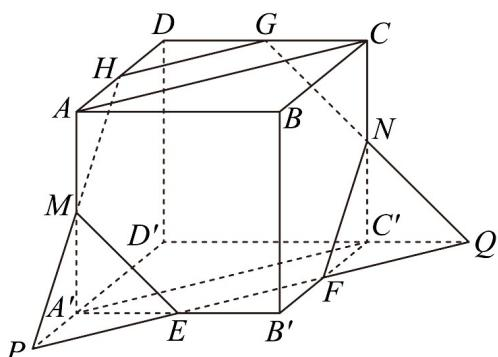
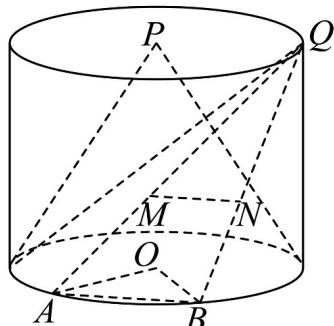
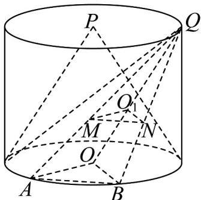

> [!faq]- 《专题17_空间直线_平面的平行_面面平行_高效培优期中专项训练_数学人》官方解析
>
> > [!success]- **【答案】**  A. $\frac{3\sqrt{3}}{2}$ B. $2\sqrt{3}$ C. $\frac{5\sqrt{3}}{2}$ D. $\frac{3\sqrt{2}}{2}$
>
> > [!note]- **【解析】**
> > 因为在棱长为 $\sqrt{2}$ 的正方体 $ABCD - A'B'C'D'$ 中，由 E、F 分别为 $A'B'$ 、 $B'C'$ 的中点，得 $EF//A'C'$ ，且 EF = 1，由 $AA'//CC'$ 且 $AA' = CC'$ ，得四边形 $AA'C'C$ 为平行四边形，即 $AC//A'C'//EF$ ，设平面 EFG 交棱 AD 于点 H，由平面 ABCD// 平面 $A'B'C'D'$ ，且平面 $EFG \cap$ 平面 $A'B'C'D' = EF$ ，平面 $EFG \cap$ 平面 ABCD = GH，得 $GH//EF//AC$ ，由 G 为 CD 的中点，得 H 为 AD 的中点，设直线 EF 分别交 $D'A'$ 、 $D'C'$ 的延长线于点 P、Q，如图：
> >
> > 
> >
> > 连接 PH 交棱 $AA'$ 于点 M，连接 QG 交棱 $CC'$ 于点 N，连接 EM、FN，则截面为六边形 EFNGHM．
> > 由 $A^{\prime}P//C^{\prime}B^{\prime}$ ，E 为 $A^{\prime}B^{\prime}$ 的中点，得 $A^{\prime}P = B^{\prime}F = \frac{\sqrt{2}}{2} = AH$ ，又 $AH//A^{\prime}P$ ，则 M 为 $AA'$ 的中点，
> > 同理 N 为 $CC'$ 的中点，六边形 EFNGHM 是边长为 $^{1}$ 的正六边形，
> > 所以 EFNGHM 截面面积为 $6 \times \frac{1}{2} \times 1^{2} \times \sin 60^{\circ} = 6 \times \frac{\sqrt{3}}{4} = \frac{3\sqrt{3}}{2}$
> >
> > 故选：A
> >
> > 20. ①斜圆锥，顾名思义，即圆锥锥体中轴线被拉斜后所形成的锥体·保持圆锥的顶点到圆锥底面的距离不变，将顶点位置改变后，所得到的锥体即为斜圆锥·
> > - **②**：祖暅原理指出：“幂势既同，则积不容异”，意思是两个同高的几何体，如在等高处的截面积相等，则体积相等·
> >
> > 
> >
> > (1)如图，已知圆柱的上底面圆心为 P，下底面圆心为 O，圆锥 $\Lambda$ 的顶点为 P，底面与圆柱的下底面相同·Q 是圆柱的上底面圆周上一点，将 Q 与圆柱下底面圆周上的点相连，记构成的封闭几何体为斜圆锥 $\Lambda' \cdot \alpha$ 是平行于圆柱底面且与圆柱有交点的平面，A，B 是圆柱下底面圆周上的两点， $AQ \cap \alpha = M, BQ \cap \alpha = N.$ (i) 证明： $QM \cdot QB = QA \cdot QN$
> >
> > (ii) 证明： $\alpha$ 截 $\Lambda'$ 所得的图形为圆面；
> >
> > (2)已知斜圆锥的底面半径为 $r$ ，底面中心与顶点的连线长度为 $L$ ，且其与底面所成的角为 $\theta$ ，求该斜圆锥的体积·
> >
> > 【答案】 $^{(1)}$ (i) 证明见解析；(ii) 证明见解析
> >
> > (2) $\frac{\pi r^{2}L\sin\theta}{3}$
> >
> > 【详解】（1）（i）由题可知平面 $\alpha //$ 平面 OAB，且平面 $QAB \cap$ 平面 OAB = AB · 又因为
> >
> > $AQ \cap \alpha = M, BQ \cap \alpha = N$ ，即平面 $QAB \cap \alpha = MN$ ，所以 $MN \parallel AB$ .
> >
> > 由于平行线分线段成比例，所以 $\frac{QM}{QA} = \frac{QN}{QB}$ ，即 $QM \cdot QB = QA \cdot QN \cdot$
> >
> > (ii) 如图，连接 $OQ$ ，记 $OQ \cap \alpha = O_1$ ，连 $O_1M, O_1N$
> >
> > 因为 $OQ \cap \alpha = O_1$ ， $AQ \cap \alpha = M$ ，所以平面 $QAO \cap$ 平面 $\alpha = O_1M$ ，又平面 $\alpha //$ 平面 $OAB$ ，平面 $QAO \cap$ 平面 $OAB = AO$ ，所以 $O_1M //OA$ ，于是有 $\frac{O_1M}{OA} = \frac{QO_1}{QO}$ ，
> >
> > 同理可得 $\frac{O_1N}{OB} = \frac{QO_1}{QO}$ ，所以 $\frac{O_1M}{OA} = \frac{O_1N}{OB}$ ，又 $OA = OB$ ，所以 $O_{1}M = O_{1}N$
> >
> > 由于 A, B 是圆柱下底面圆周上的任意两点，故结论具有一般性，所以 $\alpha$ 截 $\Lambda'$ 所得的图形是以 $O_{1}$ 为圆心的圆面.
> >
> > 
> >
> > (2) 不妨去除斜圆锥的顶点 $Q$ 在圆柱上底面圆周的限制，保留在圆柱上底面所在平面内，则 $\Lambda'$ 即为 (2) 中所述的斜圆锥.
> >
> > 记 $PO \cap \alpha = O_{2}$ ，圆柱的高为 $h \cdot$ 则与（1）类似可得 $\frac{PO_{2}}{PO} = \frac{QO_{1}}{QO}$
> >
> > 令 $\frac{PO_2}{PO} = k, k \in [0,1]$ ，根据相似可得平面 $\alpha$ 截圆锥 $\Lambda$ 所得的圆的半径为 $kr$
> >
> > 又 $\frac{QO_1}{QO} = \frac{PO_2}{PO} = k$ ，所以在圆锥 $\Lambda^{\prime}$ 中， $\alpha$ 截 $\Lambda^{\prime}$ 所得的圆的半径同样为 $kr$ .
> >
> > 由于 $k$ 在区间 $[0,1]$ 上可以任意取值，故不同高度的平面 $\alpha$ 截 $\Lambda'$ 所得的圆其面积始终等于 $\alpha$ 截 $\Lambda$ 所得的圆的面积，
> >
> > 又斜圆锥 $\Lambda^{\prime}$ 与圆锥 $\Lambda$ 的高度均为 $h$ ，根据祖暅原理可知：斜圆锥 $\Lambda^{\prime}$ 与圆锥 $\Lambda$ 的体积相等·
> >
> > 由于圆锥 $\Lambda$ 的体积为 $\frac{1}{3}\pi r^2 h$ ，其中 $h$ 是顶点到底面的距离，且 $\frac{h}{L} = \sin \theta$
> >
> > 故 $h = L\sin \theta$ ，所以斜圆锥 $\Lambda^{\prime}$ 的体积为 $\frac{\pi r^2L\sin\theta}{3}$
