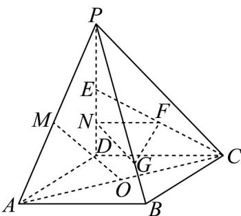
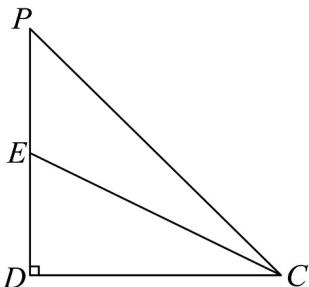
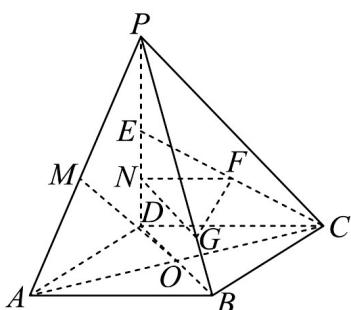

> [!faq]- 《专题17_空间直线_平面的平行_面面平行_高效培优期中专项训练_数学人》官方解析
>
> > [!success]- **【答案】** (1) $l//BC$ ，证明见解析 (2) $\frac{3\sqrt{10}}{10}$ (3) $\lambda = 3$
>
> > [!note]- **【解析】**
> > （1） $l//BC$
> >
> > 证明：因为底面 ABCD 为平行四边形，
> >
> > 所以 $BC \parallel AD$
> >
> > 又因为 $BC \notin$ 面 $PAD$ ， $AD \subset$ 面 $PAD$
> >
> > 所以 BC// 面 PAD
> >
> > 又因为 $BC \subset$ 面 $PBC$ ，面 $PBC \cap$ 平面 $PAD = l$
> >
> > 所以 $l / / BC$
> >
> > (2)
> >
> > 
> >
> > 连接 AC，则 O 为 AC 中点，又点 M 为 PA 中点，所以 MO//PC
> >
> > 异面直线 MO 与 EC 所成角即为 EC 与 PC 夹角，
> >
> > 在等腰直角三角形 $PDC$ 中，设 $\left|DP\right| = \left|DC\right| = 2a$ ，则 $\left|PE\right| = \left|DE\right| = a$ ， $\left|PC\right| = 2\sqrt{2} a$ ， $\left|CE\right| = \sqrt{5} a$
> >
> > 在 $\triangle \mathrm{PEC}$ 中，由余弦定理得， $\cos \angle PCE = \frac{\left|PC\right|^2 + \left|CE\right|^2 - \left|PE\right|^2}{2\left|PC\right|\cdot\left|CE\right|} = \frac{8a^2 + 5a^2 - a^2}{4\sqrt{10}a^2} = \frac{3\sqrt{10}}{10}$ ，
> >
> > 所以异面直线 $MO$ 与 $EC$ 所成角的余弦值为 $\frac{3\sqrt{10}}{10}$
> >
> > 
> >
> > (3) 连接 BD，如图所示，
> >
> > 因为 $N$ 为 $DE$ 的中点， $E$ 为 $PD$ 的中点，所以 $\left|PN\right| = \frac{3}{4}\left|PD\right|$
> >
> > 因为平面 $GFN \parallel$ 平面 $ABCD$ ，平面 $PBD \cap$ 平面 $ABCD = BD$
> >
> > 平面 $PBD \cap$ 平面 $GFN = GN$ ，所以 $GN // BD$
> >
> > 则 $\frac{|PN|}{|ND|} = \frac{|PG|}{|GB|} = 3$ ，即 $|PG| = 3|GB|$ ，所以 $\lambda = 3$ .
> >
> > 
