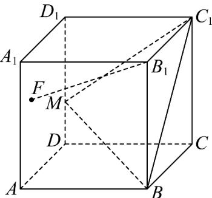
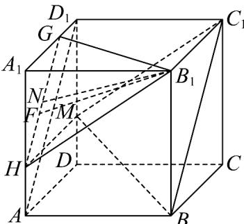
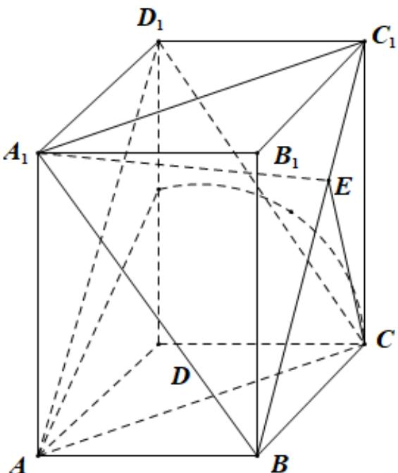
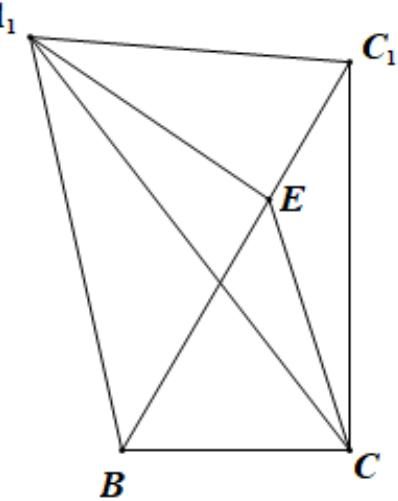

> [!faq]- 《专题17_空间直线_平面的平行_面面平行_高效培优期中专项训练_数学人》官方解析
>
> > [!success]- **【答案】** 
>
> > [!note]- **【解析】**
> > 如图所示，分别在 $AA_{1}, A_{1}D_{1}$ 取点 $H, G$ ，使得 $AH = 1, DG = 1$
> >
> > 连接 $B_{1}G, GH, B_{1}H, AD_{1}, MH$ ，可得 $GH // AD_{1}$
> >
> > 在正方体 $ABCD - A_{1}B_{1}C_{1}D_{1}$ 中，可得 $AD_{1} // BC_{1}$ ，所以 $GH // BC_{1}$
> >
> > 因为 $GH \not\subset$ 平面 $BC_{1}M$ ， $BC_{1} \subset$ 平面 $BC_{1}M$ ，所以 $GH //$ 平面 $BC_{1}M$
> >
> > 又由 $MH / / B_1C_1$ ，且 $MH = B_1C_1$ ，可得 $B_{1}C_{1}MH$ 为平行四边形，可得 $B_{1}H / / C_{1}M$
> >
> > 因为 $B_{1}H \notin$ 平面 $BC_{1}M$ ， $C_{1}M \subset$ 平面 $BC_{1}M$ ，所以 $B_{1}H //$ 平面 $BC_{1}M$
> >
> > 又因为 $GH \cap B_{1}H = H$ ，且 $GH, B_{1}H \subset$ 平面 $B_{1}GH$ ，所以平面 $B_{1}GH //$ 平面 $BC_{1}M$
> >
> > 因为 $B_{1}F / /$ 平面 $BC_{1}M$ ，且 $F$ 为正方形 $AA_{1}D_{1}D$ 内一动点，所以 $F$ 在线段 $GH$ 上，
> >
> > 在 $Rt\triangle A_{1}B_{1}H$ 中，可得 $B_{1}H = \sqrt{A_{1}B_{1}^{2} + A_{1}H^{2}} = \sqrt{13}$
> >
> > 在 $Rt\triangle A_1B_1G$ 中，可得 $B_{1}G = \sqrt{A_{1}B_{1}^{2} + A_{1}G^{2}} = \sqrt{13}$ ，且 $GH = \frac{2}{3} AD_{1} = 2\sqrt{2}$
> >
> > 所以 $\triangle B_{1}GH$ 为等腰三角形，取 $GH$ 的中点 $N$ ，连接 $B_{1}N$
> >
> > 在 $Rt\triangle B_{1}NH$ 中，可得 $B_{1}N = \sqrt{B_{1}H^{2} - HN^{2}} = \sqrt{11}$
> >
> > 所以 $B_{1}F$ 的最短距离为 $\sqrt{11}$ ，最长距离为 $\sqrt{13}$
> >
> > 所以线段 $B_{1}F$ 长度的取值范围为 $[\sqrt{11},\sqrt{13}]$ .
> >
> > 故答案为： $[\sqrt{11},\sqrt{13} ]$
> >
> > 
> >
> > 26. 长方体 $ABCD - A_{1}B_{1}C_{1}D_{1}$ 中， $AB = AD = 1$ ， $CC_{1} = 2$ ， $E$ 是线段 $BC_{1}$ 上的一动点（包括端点），则下列说法正确的是（ ）A． $A_{1}E$ 的最小值为 $\sqrt{2}$ B． $A_{1}E//$ 平面 $AD_{1}C$ C． $A_{1}E + EC$ 的最小值为 $\frac{\sqrt{170}}{5}$ D．以 $A$ 为球心， $\sqrt{2}$ 为半径的球面与侧面 $CDD_{1}C_{1}$ 的交线长是 $\frac{\pi}{2}$
> >
> > 【答案】BCD
> >
> > 【详解】
> >
> > 
> >
> > 对于 $\mathsf{A}$ ，因为在长方体中， $AB = AD = 1$ ， $CC_{1} = 2$ 故 $A_{1}C_{1} = \sqrt{2}, A_{1}B = \sqrt{5}, C_{1}B = \sqrt{5}$ ，故 $\mathrm{VA}_{1}BC_{1}$ 为等腰三角形，而 $A_{1}B^{2} + C_{1}B^{2} = 10 > 2 = A_{1}C_{1}^{2}$ ，故 $\angle A_{1}BC_{1}$ 为锐角，
> >
> > 故 $A_{1}E$ 的最小值为 $\mathrm{VA}_1BC_1$ 的边 $BC_{1}$ 上的高，设高为 $h$ ，
> >
> > 则 $\frac{1}{2} \times h \times \sqrt{5} = \frac{1}{2} \times \sqrt{2} \times \sqrt{5 - \frac{1}{2}}$ ，故 $h = \frac{3}{\sqrt{5}} = \frac{3\sqrt{5}}{5}$ ，
> >
> > 故 $A_{1}E$ 的最小值为 $\frac{3\sqrt{5}}{5}$ ，故 ${}^{\mathrm{A}}$ 错误·
> >
> > 对于 $^{B}$ ，由长方体的性质可得 $D_{1}C_{1}//AB, D_{1}C_{1}=AB$
> >
> > 故四边形 $D_{1}C_{1}BA$ 为平行四边形，故 $AD_{1}//C_{1}B$
> >
> > 而 $AD_{1} \notin$ 平面 $A_{1}C_{1}B$ ， $BC_{1} \subset$ 平面 $A_{1}C_{1}B$ ，故 $AD_{1} //$ 平面 $A_{1}C_{1}B$
> >
> > 同理 $CD_{1} / /$ 平面 $A_{1}C_{1}B$ ，而 $AD_{1}\cap CD_{1} = D_{1},AD_{1},CD_{1}\subset$ 平面 $ACD_{1}$
> >
> > 故平面 $ACD_{1}$ // 平面 $A_{1}C_{1}B$ ，而 $A_{1}E \subset$ 平面 $A_{1}C_{1}B$ ，故 $A_{1}E$ // 平面 $ACD_{1}$ ，
> >
> > 故 $^{B}$ 正确·
> >
> > 对于 C，如图，将 $VA_{1}BC_{1}$ 、 $\triangle BCC_{1}$ 放置在一个平面中，
> >
> > 则 $A_{1}E + EC$ 的最小值即为 $A_{1}C$ ，而 $\cos\angle A_{1}C_{1}B = \frac{\frac{\sqrt{2}}{2}}{\sqrt{5}} = \frac{\sqrt{10}}{10}$ ，
> >
> > $$
> > \cos \angle C C _ {1} B = \frac {2}{\sqrt {5}} = \frac {2 \sqrt {5}}{5}
> > $$
> >
> > 因为 $\angle A_{1}C_{1}B$ 、 $\angle CC_{1}B$ 均为锐角，故 $\sin\angle A_{1}C_{1}B=\frac{3\sqrt{10}}{10}$ ， $\sin\angle CC_{1}B=\frac{\sqrt{5}}{5}$ ，
> >
> > 故 $\cos \angle A_{1}C_{1}C = \frac{2\sqrt{50}}{50} -\frac{3\sqrt{50}}{50} = -\frac{\sqrt{2}}{10}$
> >
> > 故 $A_{1}C = \sqrt{2 + 4 + 2\times 2\times\sqrt{2}\times\frac{\sqrt{2}}{10}} = \sqrt{2 + 4 + \frac{4}{5}} = \sqrt{\frac{34}{5}} = \frac{\sqrt{170}}{5}$ ，故C正确·
> >
> > 对于 D，以 A 为球心， $\sqrt{2}$ 为半径的球面与侧面 $CDD_{1}C_{1}$ 的交线为 $\frac{1}{4}$ 个圆弧，
> >
> > 该圆弧的圆心为 D，半径为 $\sqrt{2-1}=1$ ，故弧长为 $\frac{1}{4}\times2\pi\times1=\frac{\pi}{2}$ ，故 D 成立.
> >
> > 故选：BCD.
> >
> > $A_{1}$
> > 
