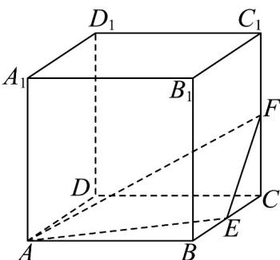
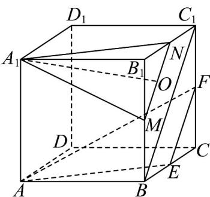

> [!faq]- 《专题17_空间直线_平面的平行_面面平行_高效培优期中专项训练_数学人》官方解析
>
> > [!success]- **【答案】** 
>
> > [!note]- **【解析】**
> > 下图所示：
> >
> > 
> >
> > 分别取棱 $BB_{1}$ 、 $B_{1}C_{1}$ 的中点 $M$ 、 $N$ ，连接 $MN$ ，连接 $BC_{1}$
> >
> > ∵ M 、 N 、 E 、 F 为所在棱的中点，∴ $MN // BC_{1}$ ， $EF // BC_{1}$
> >
> > ∴MN//EF，又MN ∉ 平面 AEF，EF ⊂ 平面 AEF，
> >
> > ∴ MN // 平面 AEF ;
> >
> > ∵ $AA_{1} // NE$ ， $AA_{1} = NE$ ，∴ 四边形 $AENA_{1}$ 为平行四边形，
> >
> > $\therefore A_{1}N //AE$ ，又 $A_{1}N \subsetneq$ 平面 $AEF$ ， $AE \subset$ 平面 $AEF$
> >
> > $\therefore A_{1}N//$ 平面 AEF ，
> >
> > 又 $A_{1}N \cap MN = N$ ， $A_{1}N, MN \subset$ 平面 $A_{1}MN$ ， $\therefore$ 平面 $A_{1}MN //$ 平面 $AEF$
> >
> > $Q$ 是侧面 $BCC_{1}B_{1}$ 内一点，且 $A_{1}Q / /$ 平面 $AEF$ ，
> >
> > 则 $Q$ 必在线段 $MN$ 上，
> >
> > 在 $\mathrm{Rt}^{\triangle}$ $A_{1}B_{1}M$ 中， $A_{1}M = \sqrt{A_{1}B_{1}^{2} + B_{1}M^{2}} = \sqrt{1 + \left(\frac{1}{2}\right)^{2}} = \frac{\sqrt{5}}{2}$ ，
> >
> > 同理，在 $\mathrm{Rt}^{\triangle}$ $A_{1}B_{1}N$ 中，求得 $A_{1}N = \frac{\sqrt{5}}{2}$
> >
> > $\therefore \triangle A_{1}MN$ 为等腰三角形，
> >
> > 当 $Q$ 在 $MN$ 中点 $O$ 时 $A_{1}Q \perp MN$ ，此时 $A_{1}Q$ 最短， $Q$ 位于 $M$ 、 $N$ 处时 $A_{1}Q$ 最长，
> >
> > $$
> > A _ {1} O = \sqrt {A _ {1} M ^ {2} - O M ^ {2}} = \sqrt {\left(\frac {\sqrt {5}}{2}\right) ^ {2} - \left(\frac {\sqrt {2}}{4}\right) ^ {2}} = \frac {3 \sqrt {2}}{4}
> > $$
> >
> > $A_{1}M = A_{1}N = \frac{\sqrt{5}}{2}$
> >
> > 所以线段 $A_{1}Q$ 长度的是大值与最小值之和为 $\frac{3\sqrt{2}}{4} +\frac{\sqrt{5}}{2} = \frac{2\sqrt{5} + 3\sqrt{2}}{4}$
