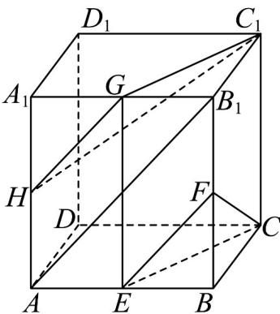

> [!faq]- 《专题17_空间直线_平面的平行_面面平行_高效培优期中专项训练_数学人》官方解析
>
> > [!success]- **【答案】** (1)证明见解析 (2) 存在， $\frac{A_{1}H}{A_{1}A}=\frac{1}{2}.$
>
> > [!note]- **【解析】**
> > （1）证明：如图所示，连接 $EG$ ，
> >
> > 因为 E, G 分别是棱 AB, $A_{1}B_{1}$ 的中点，所以 $EG //BB_{1}, EG = BB_{1}$
> >
> > 由长方体的性质，可知 $BB_{1} / / CC_{1}, BB_{1} = CC_{1}$ ，则 $EG / / CC_{1}$ 且 $EG = CC_{1}$
> >
> > 所以四边形 $CEGC_{1}$ 是平行四边形，所以 $CE // C_{1}G$
> >
> > 又因为 $CE \subset$ 平面 CEF ，且 $C_{1}G \not\subset$ 平面 CEF ，所以 $C_{1}G //$ 平面 CEF .
> >
> > (2) 解：取棱 $AA_{1}$ 的中点 $_{H}$ ，连接 GH, $C_{1}H$ ，平面 $C_{1}GH \parallel$ 平面 CEF，此时 $\frac{A_{1}H}{A_{1}A} = \frac{1}{2}$ .
> >
> > 理由如下：
> >
> > 连接 $AB_{1}$ ，因为 $E, F$ 分别为棱 $AB, BB_{1}$ 的中点，所以 $EF // AB_{1}$
> >
> > 因为 G, H 分别为棱 $A_{1}B_{1}, A_{1}A$ 的中点，所以 $GH // AB_{1}$ ，所以 $GH // EF$ ，
> >
> > 因为 $EF \subset$ 平面 $CEF$ 且 $GH \notin$ 平面 $CEF$ ，所以 $GH //$ 平面 $CEF$
> >
> > 由（1）可知 $C_1G //$ 平面 $CEF$ ，且 $C_1G \subset$ 平面 $C_1GH$ ， $GH \nmid$ 平面 $C_1GH$ ， $C_1G \cap GH = G$ ，所以平面 $C_1GH //$ 平面 $CEF$ ，
> >
> > 故在棱 $AA_{1}$ 上存在点 $H$ ，使得平面 $C_{1}GH // 平面 CEF$ ，此时 $\frac{A_{1}H}{A_{1}A} = \frac{1}{2}$ .
> >
> > 
