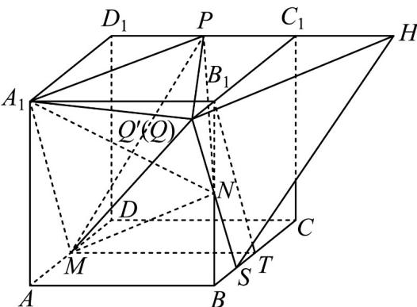

> [!faq]- 《专题17_空间直线_平面的平行_面面平行_高效培优期中专项训练_数学人》官方解析
>
> > [!success]- **【答案】** (1) $\frac{1}{2}$ (2)3
>
> > [!note]- **【解析】**
> > （1）
> >
> > 
> >
> > 如图，取 $BC$ 的中点为 $T$ ，连接 $B_{1}T$ ，取 $BT$ 的中点为S，连接SN并延长交直线 $B_{1}C_{1}$ 于 $Q^{\prime}$
> >
> > 过 $Q^{\prime}$ 在平面 $A_{1}B_{1}C_{1}D_{1}$ 作 $A_{1}P$ 的平行线 $Q^{\prime}H$ ，交 $D_{1}C_{1}$ 的延长线于 $H$ ，连接 $MT$
> >
> > 由长方体的性质可得 $AB // MT, AB = MT$ ，而 $A_{1}B_{1} // AB, A_{1}B_{1} = AB$
> >
> > 故 $A_{1}B_{1} //MT, A_{1}B_{1} = MT$ ，故四边形 $A_{1}B_{1}TM$ 为平行四边形，所以 $A_{1}M //B_{1}T$
> >
> > 因为 $B_{1}N = NB, BS = ST$ ，故 $SQ' // B_{1}T$ ，故 $SQ' // A_{1}M$
> >
> > 而 $SQ^{\prime} \notin$ 平面 $A_{1}MP$ ， $A_{1}M \subset$ 平面 $A_{1}MP$ ，故 $SQ^{\prime} //$ 平面 $A_{1}MP$
> >
> > 同理 $HQ^{\prime} / /$ 平面 $A_{1}MP$ ，而 $SQ^{\prime}\cap HQ^{\prime} = Q^{\prime},SQ^{\prime},HQ^{\prime}\subset$ 平面 $SQ^{\prime}H$
> >
> > 故平面 $SQ'H \parallel$ 平面 $A_{1}MP$ ，又 $N \in$ 平面 $SQ'H$ ，
> >
> > 故平面 $SQ'H$ 即为平面 $\alpha$ ，故 $Q', Q$ 重合.
> >
> > 因为 $B_{1}Q//ST$ ，故四边形 $B_{1}QST$ 为平行四边形，故 $B_{1}Q = ST = \frac{1}{2}$ .
> >
> > (2) $\because P$ 为 $D_{1}C_{1}$ 中点， $S_{\triangle A_{1}PD_{1}} = \frac{1}{2} \times 2 \times 2 = 2, S_{\triangle C_{1}PQ} = \frac{1}{2} \times 2 \times \left(2 + \frac{1}{2}\right) = \frac{5}{2}$ ，
> >
> > 而 $S_{\text{梯形} A_1D_1C_1Q} = \frac{1}{2} \times 4 \times \left(2 + \frac{5}{2}\right) = 9$ ，故 $S_{\triangle A_1PQ} = 9 - 2 - \frac{5}{2} = \frac{9}{2}$ .
> >
> > 由（1）知： $V_{N-A_{1}MP}=V_{Q-A_{1}MP}=V_{M-A_{1}QP}=\frac{1}{3}S_{\triangle A_{1}QP}\cdot AA_{1}=3$
